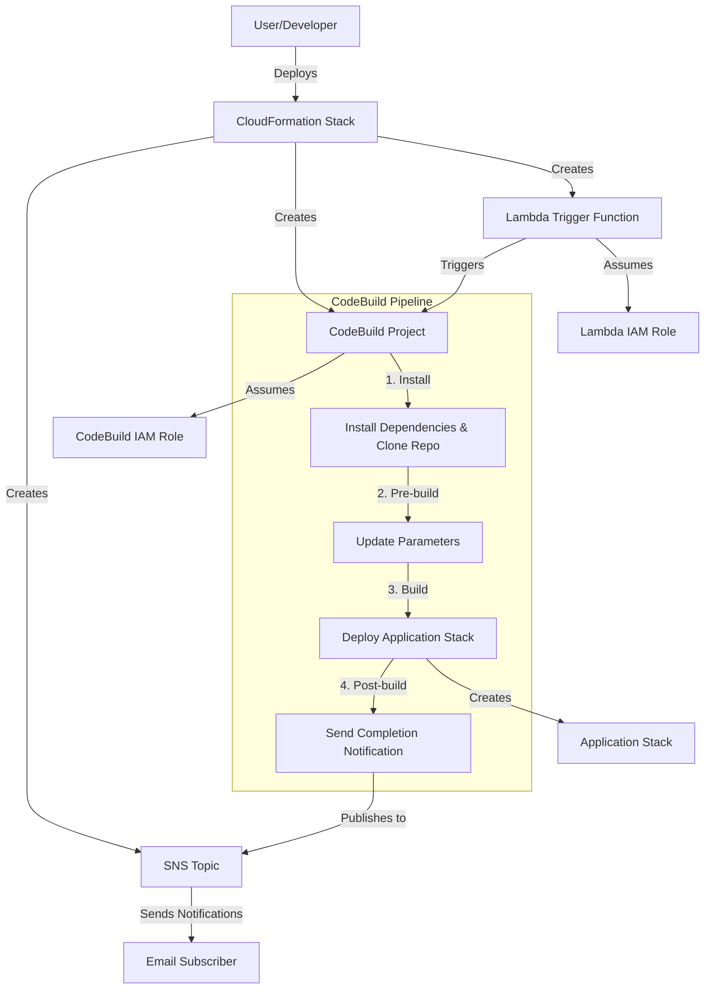

# CloudFormation One-Click Deployment Guidelines

This document outlines the fundamental rules and architecture patterns for implementing CloudFormation templates that enable one-click deployments of generative AI solutions, based on the GenU and Dify implementation examples.

## Core Architecture Pattern

The one-click deployment architecture follows this pattern:



## Implementation Rules

### 1. CloudFormation Template Structure

- **Template Format**: Use `AWSTemplateFormatVersion: '2010-09-09'` and include a descriptive `Description`.
- **Metadata**: Include `AWS::CloudFormation::Interface` to organize parameters into logical groups.
- **Parameters**: Define all configurable aspects of the deployment as parameters.
- **Resources**: Organize resources in a logical sequence (notification → roles → build → trigger).
- **Outputs**: Provide useful information about the deployed resources.

### 2. Required Components

Every one-click deployment template must include:

1. **SNS Topic and Subscription**:
   - For sending deployment notifications
   - Must subscribe to the email provided as a parameter

2. **CodeBuild Project**:
   - With appropriate IAM roles and policies
   - Environment variables derived from CloudFormation parameters
   - BuildSpec that follows the standard phases (install, pre-build, build, post-build)

3. **Custom Resource with Lambda Trigger**:
   - To initiate the CodeBuild project automatically
   - Must handle Create, Update, and Delete events appropriately

4. **IAM Roles and Policies**:
   - For CodeBuild and Lambda functions
   - Follow principle of least privilege where possible

### 3. Parameter Guidelines

- **Required Parameters**:
  - `NotificationEmailAddress`: For deployment notifications
  - Application-specific configuration parameters

- **Optional Parameters with Defaults**:
  - Environment/deployment stage
  - Region selections
  - Security configurations (IP ranges, access controls)

- **Parameter Validation**:
  - Use `AllowedPattern` for format validation (e.g., email addresses)
  - Use `AllowedValues` for enumerated options
  - Include `ConstraintDescription` for user-friendly error messages

### 4. CodeBuild BuildSpec Structure

The BuildSpec should follow this standard structure:

1. **Install Phase**:
   - Set up runtime environments
   - Clone the application repository
   - Install dependencies
   - Send initial notification

2. **Pre-build Phase**:
   - Update application parameters/configuration
   - Prepare the environment for deployment

3. **Build Phase**:
   - Check if CDK bootstrap is needed and run if required
   - Deploy the application stack
   - Collect deployment outputs and information

4. **Post-build Phase**:
   - Send completion notification with application details
   - Clean up temporary resources

### 5. Security Best Practices

- **IP Restrictions**:
   - Always provide parameters for IP restrictions
   - Use sensible defaults that encourage security
   - Include clear warnings when defaults allow public access

- **Self-signup Controls**:
   - Default to disabled self-signup
   - Require explicit domain restrictions when self-signup is enabled

- **IAM Permissions**:
   - Use least privilege where possible
   - Scope permissions to specific resources

### 6. Notification Standards

- **Initial Notification**:
   - Send when deployment starts
   - Include basic information about the deployment

- **Completion Notification**:
   - Include application URL
   - Include user management URL if applicable
   - List key configuration parameters
   - Provide next steps or additional setup instructions

### 7. Error Handling

- **CloudFormation Custom Resource**:
   - Must properly handle and report errors
   - Should send FAILED status with error details

- **CodeBuild**:
   - Include error handling in scripts
   - Capture and report meaningful error messages

## Implementation Examples

### Parameter Definition Example

```yaml
Parameters:
  NotificationEmailAddress:
    Type: String
    Description: Email address to receive deployment notifications
    AllowedPattern: "^[a-zA-Z0-9._%+-]+@[a-zA-Z0-9.-]+\\.[a-zA-Z]{2,}$"
    ConstraintDescription: Must be a valid email address
  
  AllowedIpV4AddressRanges:
    Type: String
    Default: ""
    Description: Allowed IPv4 address ranges for access (comma separated)
```

### SNS Topic and Subscription Example

```yaml
DeploymentNotificationTopic:
  Type: AWS::SNS::Topic
  Properties:
    DisplayName: Deployment Notifications
    TopicName: !Sub 'Notification-for-${AWS::StackName}'
    KmsMasterKeyId: 'alias/aws/sns'

DeploymentNotificationSubscription:
  Type: AWS::SNS::Subscription
  Properties:
    Protocol: email
    TopicArn: !Ref DeploymentNotificationTopic
    Endpoint: !Ref NotificationEmailAddress
```

### Custom Resource Trigger Example

```yaml
DeploymentTrigger:
  Type: AWS::CloudFormation::CustomResource
  Properties:
    ServiceToken: !GetAtt TriggerFunction.Arn
    ProjectName: !Ref DeploymentProject
    ServiceTimeout: 600

TriggerFunction:
  Type: AWS::Lambda::Function
  Properties:
    Handler: index.handler
    Role: !GetAtt TriggerFunctionRole.Arn
    Runtime: nodejs20.x
    Timeout: 30
    Code:
      ZipFile: |
        const { CodeBuildClient, StartBuildCommand } = require('@aws-sdk/client-codebuild');
        const response = require('cfn-response');

        exports.handler = async (event, context) => {
          console.log('Event:', JSON.stringify(event, null, 2));
          
          const physicalResourceId = `CodeBuildTrigger-${event.ResourceProperties.ProjectName}`;
          const responseData = {};
          
          try {
            const codebuild = new CodeBuildClient({ 
              region: process.env.AWS_REGION,
              maxAttempts: 3
            });

            if (event.RequestType === 'Create' || event.RequestType === 'Update') {
              const command = new StartBuildCommand({ 
                projectName: event.ResourceProperties.ProjectName 
              });
              const result = await codebuild.send(command);
              responseData.BuildId = result.build.id;
            }
            
            await response.send(event, context, response.SUCCESS, responseData, physicalResourceId);
          } catch (error) {
            console.error('Error:', error);
            await response.send(event, context, response.FAILED, { Error: error.message }, physicalResourceId);
          }
        };
```

## Adapting for New Applications

When adapting this pattern for new applications, follow these comprehensive steps based on successful implementations like GenU and Dify:

1. **Analyze Application Architecture and Dependencies**:
   - Use MCP (Model Context Protocol) tools like `github` and its `get_file_contents` to analyze README.md and documentation
   - Identify the deployment method (CDK, CloudFormation, Terraform, etc.). We prioritize deployment by CDK.
   - Determine runtime requirements (Node.js version, Python dependencies, etc.)
   - Check for required AWS services and permissions

2. **Identify Application-Specific Parameters**:
   - Core configuration parameters (environment, region, model settings)
   - Security parameters (IP restrictions, authentication methods)
   - Feature toggles (RAG capabilities, agent enablement, etc.)
   - Integration parameters (existing resources, external services)

3. **Implement Build Steps and Parameter Handling**:
   - Basically, copy from existing CloudFormation file (`deployments/genu/GenUDeploymentStack.yaml`, etc) then edit by following Implementation Rule.
   - Modify the parameters based on analysis at step2.

4. **Test Deployment Scenarios**:
   - Verify deployment in a AWS account. You need approval from human.
   - Test with various parameter combinations
   - Validate error handling and recovery
   - Check notification content and formatting
   - Ensure proper resource cleanup on failure or deletion

### Commands for development

Deployment
(`--parameters` depends on tool)

```bash
aws cloudformation create-stack \
  --stack-name XXXX \
  --template-body file://XXXX.yaml \
  --capabilities CAPABILITY_IAM CAPABILITY_NAMED_IAM \
  --parameters \
      ParameterKey=NotificationEmailAddress,ParameterValue=example@example.co.jp \
      ParameterKey=Environment,ParameterValue=dev \
      ParameterKey=RAGEnabled,ParameterValue=false \
      ParameterKey=SelfSignUp,ParameterValue=true
```

Monitoring

```bash
aws cloudformation describe-stacks --stack-name XXXX
aws cloudformation describe-stack-events --stack-name XXXX
```

Delete Stack

```bash
aws cloudformation delete-stack --stack-name XXXX
```

Validate template:
```bash
aws cloudformation validate-template --template-body file://XXXX.yaml
```

Test

Verify stack resources and outputs:
```bash
aws cloudformation list-stack-resources --stack-name XXXX
aws cloudformation describe-stacks --stack-name XXXX --query "Stacks[0].Outputs"
```

## Conclusion

Following these guidelines will ensure consistent, reliable, and user-friendly one-click deployments for generative AI solutions. The architecture pattern leverages CloudFormation, CodeBuild, and Lambda to create a seamless deployment experience while providing appropriate notifications and configuration options.
