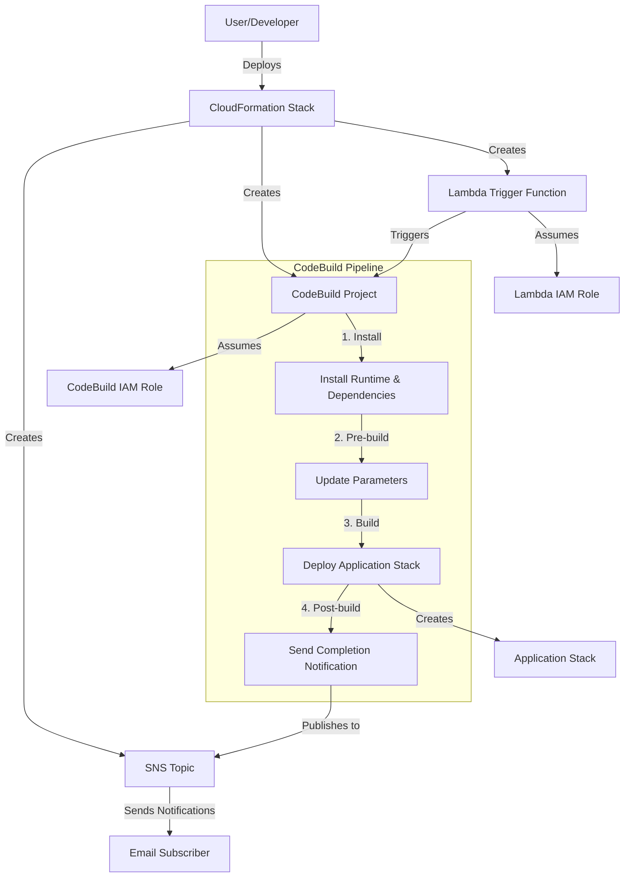

# CloudFormation One-Click Deployment Guidelines

## 1. Goal

Deliver **fast, safe, reliable time-to-experience** for generative AI solutions through one-click deployment.

### Design Principles
- **One Click to Value**: Single CloudFormation action deploys and runs the solution
- **Security First**: Least privilege IAM, IP restrictions, secure defaults
- **Self-Healing**: Automated setup with clear progress notifications and actionable errors

## 2. What We Implement

A CloudFormation template that orchestrates automated CDK deployment via CodeBuild, eliminating the need for local development environment setup.

### Key Components
1. **CloudFormation Stack** - Entry point with user-configurable parameters
2. **CodeBuild Pipeline** - Automated build and deployment execution
3. **SNS Notifications** - Deployment progress and completion alerts
4. **Lambda Trigger** - Automatic pipeline initiation

## 3. Architecture Pattern

The one-click deployment architecture follows this pattern:



## 4. How to Implement

### 4.1 CloudFormation Stack

The entry point template that defines all resources and user-configurable parameters.

**Template Structure:**
- Use `AWSTemplateFormatVersion: '2010-09-09'` with descriptive `Description`
- Include `AWS::CloudFormation::Interface` metadata to organize parameters
- Define parameters for all configurable aspects
- Organize resources logically: SNS → IAM Roles → CodeBuild → Lambda Trigger
- Provide useful outputs about deployed resources

**Parameter Guidelines:**
- **Required**: `NotificationEmailAddress` and application-specific configuration
- **Optional with Defaults**: Environment, region, security settings (IP ranges, access controls)
- **Validation**: Use `AllowedPattern` for format validation, `AllowedValues` for enums, `ConstraintDescription` for error messages

**Security Best Practices:**
- Always provide parameters for IP restrictions with sensible defaults
- Default self-signup to disabled; require explicit domain restrictions when enabled
- Use least privilege IAM permissions scoped to specific resources
- Include clear warnings when defaults allow public access

**Example:**
```yaml
Parameters:
  NotificationEmailAddress:
    Type: String
    Description: Email address to receive deployment notifications
    AllowedPattern: "^[a-zA-Z0-9._%+-]+@[a-zA-Z0-9.-]+\\.[a-zA-Z]{2,}$"
    ConstraintDescription: Must be a valid email address
  
  AllowedIpV4AddressRanges:
    Type: String
    Default: ""
    Description: Allowed IPv4 address ranges for access (comma separated)
```

### 4.2 CodeBuild Pipeline

Automated build and deployment execution that runs the CDK deployment.

**Required Configuration:**
- IAM role with appropriate permissions for CDK deployment
- Environment variables derived from CloudFormation parameters
- BuildSpec following standard phases: install → pre-build → build → post-build

**BuildSpec Structure:**

1. **Install Phase**: Set up runtime, clone repository, install dependencies, send initial notification
2. **Pre-build Phase**: Update application parameters/configuration
3. **Build Phase**: Check CDK bootstrap, deploy application stack, extract deployment information
4. **Post-build Phase**: Send completion notification, clean up temporary resources

**Parameter Extraction Best Practice:**

✅ **RECOMMENDED: CloudFormation Outputs Approach**
```bash
# Get deployment information using CloudFormation outputs
STACK_NAME=$(aws cloudformation describe-stacks --query "Stacks[?contains(StackName, 'AppStackPattern')].StackName" --output text)
APP_URL=$(aws cloudformation describe-stacks --stack-name $STACK_NAME --query "Stacks[0].Outputs[?contains(OutputKey, 'FrontendUrl')].OutputValue" --output text)
USER_POOL_ID=$(aws cloudformation describe-stacks --stack-name $STACK_NAME --query "Stacks[0].Outputs[?contains(OutputKey, 'UserPoolId')].OutputValue" --output text)
```

❌ **NOT RECOMMENDED: Temporary File Parsing**
```bash
# Avoid this approach - unreliable and hard to debug
if [ -f .cdk-outputs.json ]; then
  APP_URL=$(cat .cdk-outputs.json | python3 -c "complex parsing logic")
else
  APP_URL="Check CloudFormation outputs"  # Poor user experience
fi
```

**Why CloudFormation Outputs is Superior:**
- Reliability: Direct API calls vs. dependency on temporary files
- Debuggability: Can be tested independently outside CodeBuild
- Flexibility: `contains()` queries handle CDK-generated random suffixes
- Consistency: Same pattern across all deployment solutions

### 4.3 SNS Notifications

Deployment progress and completion alerts sent to users.

**Configuration:**
```yaml
DeploymentNotificationTopic:
  Type: AWS::SNS::Topic
  Properties:
    DisplayName: Deployment Notifications
    TopicName: !Sub 'Notification-for-${AWS::StackName}'
    KmsMasterKeyId: 'alias/aws/sns'

DeploymentNotificationSubscription:
  Type: AWS::SNS::Subscription
  Properties:
    Protocol: email
    TopicArn: !Ref DeploymentNotificationTopic
    Endpoint: !Ref NotificationEmailAddress
```

**Notification Standards:**
- **Initial**: Send when deployment starts with basic information
- **Completion**: Include application URL, user management URL, key configuration parameters, next steps

### 4.4 Lambda Trigger

Automatic pipeline initiation via CloudFormation Custom Resource.

**Implementation:**
```yaml
DeploymentTrigger:
  Type: AWS::CloudFormation::CustomResource
  Properties:
    ServiceToken: !GetAtt TriggerFunction.Arn
    ProjectName: !Ref DeploymentProject
    ServiceTimeout: 600

TriggerFunction:
  Type: AWS::Lambda::Function
  Properties:
    Handler: index.handler
    Role: !GetAtt TriggerFunctionRole.Arn
    Runtime: nodejs20.x
    Timeout: 30
    Code:
      ZipFile: |
        const { CodeBuildClient, StartBuildCommand } = require('@aws-sdk/client-codebuild');
        const response = require('cfn-response');

        exports.handler = async (event, context) => {
          console.log('Event:', JSON.stringify(event, null, 2));
          
          const physicalResourceId = `CodeBuildTrigger-${event.ResourceProperties.ProjectName}`;
          const responseData = {};
          
          try {
            const codebuild = new CodeBuildClient({ 
              region: process.env.AWS_REGION,
              maxAttempts: 3
            });

            if (event.RequestType === 'Create' || event.RequestType === 'Update') {
              const command = new StartBuildCommand({ 
                projectName: event.ResourceProperties.ProjectName 
              });
              const result = await codebuild.send(command);
              responseData.BuildId = result.build.id;
            }
            
            await response.send(event, context, response.SUCCESS, responseData, physicalResourceId);
          } catch (error) {
            console.error('Error:', error);
            await response.send(event, context, response.FAILED, { Error: error.message }, physicalResourceId);
          }
        };
```

**Error Handling:**
- Must properly handle and report errors
- Send FAILED status with error details to CloudFormation
- Handle Create, Update, and Delete events appropriately

## 5. Implementation Process

When adapting this pattern for new applications, follow these comprehensive steps based on successful implementations like GenU and Dify:

### 5.1 Analyze Application Architecture and Dependencies

- Use MCP (Model Context Protocol) tools like `github` and its `get_file_contents` to analyze README.md and documentation
- You also allowed to clone a repository to `.workspace`
- Identify the deployment method (CDK, CloudFormation, Terraform, etc.). We prioritize deployment by CDK.
- Determine runtime requirements (Node.js version, Python dependencies, etc.)
- Check for required AWS services and permissions

### 5.2 Identify Application-Specific Parameters

- Core configuration parameters (environment, region, model settings)
- Security parameters (IP restrictions, authentication methods)
- Feature toggles (RAG capabilities, agent enablement, etc.)
- Integration parameters (existing resources, external services)

### 5.3 Create Implementation Plan

- Create a plan document in `.workspace/` directory with todo lists
- Include analysis findings from sections 5.1 and 5.2
- List specific components to implement (CloudFormation Stack, CodeBuild Pipeline, SNS Notifications, Lambda Trigger)
- Define parameter mappings and BuildSpec modifications needed
- Get human approval before proceeding to implementation

### 5.4 Implement Build Steps and Parameter Handling

- Copy from existing CloudFormation file (`deployments/genu/GenUDeploymentStack.yaml`, etc) as a template
- Follow the component specifications in section 4 (CloudFormation Stack, CodeBuild Pipeline, SNS Notifications, Lambda Trigger)
- Modify the parameters based on analysis from section 5.2

### 5.5 Test Deployment Scenarios

- Verify deployment in a AWS account. You need approval from human.
- Test with various parameter combinations
- Validate error handling and recovery
- Check notification content and formatting
- Ensure proper resource cleanup on failure or deletion

#### 5.5.1 Development Commands

**Deploy stack:**
```bash
aws cloudformation create-stack \
  --stack-name XXXX \
  --template-body file://XXXX.yaml \
  --capabilities CAPABILITY_IAM CAPABILITY_NAMED_IAM \
  --parameters '[
    {"ParameterKey": "NotificationEmailAddress", "ParameterValue": "example@example.co.jp"},
    {"ParameterKey": "Environment", "ParameterValue": "dev"}
  ]'
```

**Monitor deployment:**
```bash
aws cloudformation describe-stack-events --stack-name XXXX
aws logs tail /aws/codebuild/<PROJECT_NAME> --follow
```

**Delete stack:**
```bash
aws cloudformation delete-stack --stack-name XXXX
```

**Validate template:**
```bash
aws cloudformation validate-template --template-body file://XXXX.yaml
```

### 5.6 Documentation

After successful deployment testing, update the project documentation:

- Create documentation for the new solution in the `docs/` directory
- Follow the existing documentation structure and style
- Update `mkdocs.yml` to add navigation entry for the new solution
- Include deployment instructions, parameters, and usage examples

## Conclusion

Following these guidelines will ensure consistent, reliable, and user-friendly one-click deployments for generative AI solutions. The architecture pattern leverages CloudFormation, CodeBuild, and Lambda to create a seamless deployment experience while providing appropriate notifications and configuration options.
