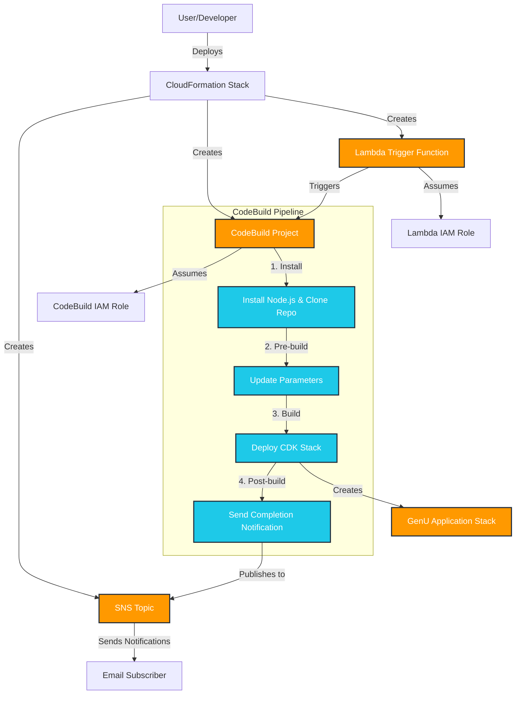

# AWS Generative AI Solution Box

本リポジトリでは、オープンソースで開発されている生成 AI の活用や開発に役立つアプリケーションを 1 click でデプロイする機能を提供します。様々なアプリケーションが動かせる AWS のプラットフォームとしての便利さを体感いただければ幸いです。

※本格的な開発やパラメーターのカスタマイズには開発環境が必要なことはご留意ください。

Web Site : https://aws-samples.github.io/sample-one-click-generative-ai-solutions/

## Generative AI Use Cases (GenU)

[Generative AI Use Cases](https://github.com/aws-samples/generative-ai-use-cases-jp) は、生成 AI の様々なユースケースがあらかじめ組み込まれたアプリケーションです。生成 AI の活用をこれから社内に普及するにあたり、安全かつ誰もが容易に使える環境を構築したい場合に最適です。

 [](https://ap-northeast-1.console.aws.amazon.com/cloudformation/home#/stacks/create/review?stackName=GenUDeploymentStack&templateURL=https://aws-ml-jp.s3.ap-northeast-1.amazonaws.com/asset-deployments/GenUDeploymentStack.yaml) 

### Parameters

ボタンを押すと次のパラメーターを設定できる画面に遷移します。

* Environment (default: dev)
   * デプロイする環境の種別です。`packages/cdk/parameter.ts` で指定する環境です。Environment の値を切り替えることで複数の GenU 環境をデプロイできます
* NotificationEmailAddress
   * デプロイの開始・終了を通知するメールアドレスです。
* ModelRegion
   * Amazon Bedrock のモデルを利用するリージョンです
* RAGEnabled (default: None)
   * RAG の設定を選択します。"Knowledge-Bases" は Amazon Bedrock Knowledge Bases 、"Kendra" は Amazon Kendra Developer Edition 、"Both" は両方使用します。"Kendra-Enterprise" のように "Enterprise" では Enterprise Edition を使用します
* SelfSignUp (default: false)
   * セルフサインアップの有効 / 無効を切り替えます。
* AllowedSignUpEmailDomains
   * カンマ区切りで利用可能なメールドメインを設定します
* AllowedIpV4AddressRanges
   * アクセス可能な IP アドレスを指定 (IPv4)
* AllowedIpV6AddressRanges
   * アクセス可能な IP アドレスを指定 (IPv6)

`AllowedIpV4AddressRanges` や `AllowedIpV6AddressRanges` を用いて、できるだけ IP 制限をかけることを推奨します。 IP 制限を書けない場合は Public Access 可能な状態でデプロイされますが、SelfSignUp は false にしているためログインには AWS アカウントでのユーザー作成 (Amazon Cognito) が必要です。

### デプロイ後のアップデートとパラメーター変更の手順
GenU を 1 click でデプロイしたあとに、GenU のアップデートやパラメーター変更を行う方法を紹介します。[詳細はこちらをご覧ください。](/docs/solutions/generative-ai-use-cases-update.md)


## Dify on AWS

[Dify](https://dify.ai/jp) は、LLMアプリケーション開発プラットフォームで、生成AIを用いたチャットボットやワークフローをGUIで簡単に作成できます。複数ステップにまたがる生成AIの処理等を実装したい時に最適です。AWSへのデプロイには [dify-self-hosted-on-aws](https://github.com/aws-samples/dify-self-hosted-on-aws) を使うことで、マネージドサービスを活用した安全で拡張性のある環境を容易に構築できます。

 [](https://us-east-1.console.aws.amazon.com/cloudformation/home#/stacks/create/review?stackName=DifyDeploymentStack&templateURL=https://aws-ml-jp.s3.ap-northeast-1.amazonaws.com/asset-deployments/DifyDeploymentStack.yaml)

### Parameters

* NotificationEmailAddress
   * デプロイの開始・終了を通知するメールアドレスです。
* Region
   * デプロイするリージョンです
* AutoPause
   * データベースの自動停止を ON / OFF にします。自動停止後は復旧に 10 秒程度かかります
* AllowedIpV4Ciders
   * 接続可能な IpV4 Cider です (0.0.0.0/1 など)
* AllowedIpV6Ciders
   * 接続可能な IpV6 Cider です (::/1 など)

## Bedrock Chat (BrChat)

[Bedrock Chat](https://github.com/aws-samples/bedrock-chat) は、Amazon Bedrock を活用した多言語対応の生成 AI プラットフォームです。シンプルなチャット機能だけでなく、ナレッジベース (RAG) を活用したカスタムボット作成、ボットストアを通じたボット共有、エージェント機能によるタスク自動化をサポートしています。生成 AI の特性を理解し、実践的に活用したい場合に最適です。

 [](https://us-east-1.console.aws.amazon.com/cloudformation/home#/stacks/create/review?stackName=BrChatDeploymentStack&templateURL=https://aws-ml-jp.s3.ap-northeast-1.amazonaws.com/asset-deployments/BrChatDeploymentStack.yaml)

### Parameters

* NotificationEmailAddress
   * デプロイの開始・終了を通知するメールアドレスです。
* BedrockRegion
   * Amazon Bedrock のモデルを利用するリージョンです（us-east-1, us-west-2, ap-northeast-1）
* SelfSignUp (default: false)
   * セルフサインアップの有効 / 無効を切り替えます。
* AllowedSignUpEmailDomains
   * カンマ区切りで利用可能なメールドメインを設定します
* AllowedIpV4AddressRanges
   * アクセス可能な IP アドレスを指定 (IPv4)
* AllowedIpV6AddressRanges
   * アクセス可能な IP アドレスを指定 (IPv6)
* EnableRagReplicas (default: false)
   * RAG データベースのレプリカを有効化します（可用性が向上しますがコストも増加します）
* Version (default: v3)
   * デプロイする Bedrock Chat のバージョンを指定します

## GenAI Design Studio

[GenAI Design Studio](https://github.com/aws-samples/sample-genai-design-studio) は、Amazon Nova Canvas を活用したバーチャル試着ソリューションです。アパレル業界やECサービスにおいて、服飾デザインから実際のモデル着用撮影まで、様々なプロセスの効率化を目指します。

 [](https://ap-northeast-1.console.aws.amazon.com/cloudformation/home#/stacks/create/review?stackName=GenStudioDeploymentStack&templateURL=https://aws-ml-jp.s3.ap-northeast-1.amazonaws.com/asset-deployments/GenStudioDeploymentStack.yaml)

### Parameters

* NotificationEmailAddress
   * デプロイの開始・終了を通知するメールアドレスです。
* SelfSignUp (default: true)
   * セルフサインアップの有効 / 無効を切り替えます。
* AllowedSignUpEmailDomains
   * カンマ区切りで利用可能なメールドメインを設定します。メールドメインは「@」を含めずに指定してください。（例: example.co.jp）
* AllowedIpV4AddressRanges (default: 0.0.0.0/1,128.0.0.0/1)
   * アクセス可能な IP アドレスを指定 (IPv4)
* AllowedIpV6AddressRanges (default: 0000:0000:0000:0000:0000:0000:0000:0000/1,8000:0000:0000:0000:0000:0000:0000:0000/1)
   * アクセス可能な IP アドレスを指定 (IPv6)

### 機能

* **モデル生成**: テキストプロンプトでバーチャルモデル画像を生成
* **バーチャル試着**: Amazon Nova Canvas を使用した服の試着機能
* **背景置換**: テキスト記述による背景の自然な置き換え

## ComfyUI on AWS

[ComfyUI](https://github.com/comfyanonymous/ComfyUI) は、ノードベースの生成AI画像生成ツールで、Stable Diffusion や様々なモデルを組み合わせて高品質な画像を生成できます。複雑なワークフローを視覚的に構築し、画像生成プロセスを細かく制御したい場合に最適です。AWSへのデプロイには [cost-effective-aws-deployment-of-comfyui](https://github.com/aws-samples/cost-effective-aws-deployment-of-comfyui) を使用して、スケーラブルで費用対効果の高い環境を構築できます。

 [](https://ap-northeast-1.console.aws.amazon.com/cloudformation/home#/stacks/create/review?stackName=ComfyUIDeploymentStack&templateURL=https://aws-ml-jp.s3.ap-northeast-1.amazonaws.com/asset-deployments/ComfyUIDeploymentStack.yaml)

### Parameters

* Environment (default: dev)
   * デプロイする環境の種別です
* NotificationEmailAddress
   * デプロイの開始・終了を通知するメールアドレスです
* SelfSignUp (default: false)
   * セルフサインアップの有効 / 無効を切り替えます（注意：パブリックアクセスを許可する場合は慎重に検討してください）
* AllowedSignUpEmailDomains
   * カンマ区切りで利用可能なメールドメインを設定します（例: example1.co.jp, example2.co.jp）
* AllowedIpV4AddressRanges
   * アクセス可能な IPv4 アドレス範囲を指定します（例: 10.0.0.100/32, 192.168.0.0/24）。現在のパブリック IP アドレスは https://checkip.amazonaws.com/ で確認できます
* AllowedIpV6AddressRanges
   * アクセス可能な IPv6 アドレス範囲を指定します

## Remote SWE Agents

[Remote SWE Agents](https://github.com/aws-samples/remote-swe-agents) は、AI による自律型のソフトウェア開発エージェントの実装例です。このエージェントはタスクごとに専用の開発環境内で動作し、ユーザーの PC に依存することなく開発作業を行います。

[](https://us-west-2.console.aws.amazon.com/cloudformation/home#/stacks/create/review?stackName=RemoteSweDeploymentStack&templateURL=https://aws-ml-jp.s3.ap-northeast-1.amazonaws.com/asset-deployments/RemoteSweDeploymentStack.yaml)

### Parameters

* NotificationEmailAddress
  + デプロイの開始・終了を通知するメールアドレスです。このアドレスは初期ウェブアプリユーザーとしても設定されます。
* GitHubAccessTokenValue
  + GitHub の個人アクセストークン（PAT）で、エージェントが GitHub リポジトリにアクセスするために使用します。
  + 作成方法：[GitHub Personal Access Tokenの作成](https://docs.github.com/ja/authentication/keeping-your-account-and-data-secure/managing-your-personal-access-tokens)
  + 必要なスコープ：`repo`, `workflow`, `read:org`
* AllowedIpV4AddressRanges
  + ウェブアプリにアクセス可能な IPv4 CIDR 範囲を指定します。
* AllowedIpV6AddressRanges
  + ウェブアプリにアクセス可能な IPv6 CIDR 範囲を指定します。
* WorkerAdditionalPolicies
  + ワーカーインスタンスに追加で付与する IAM マネージドポリシーを指定します。

## Review & Assessment Powered by Intelligent Documentation (RAPID)

[RAPID](https://github.com/aws-samples/review-and-assessment-powered-by-intelligent-documentation) は、生成 AI (Amazon Bedrock) を活用した書類審査ソリューションです。膨大な書類と複雑なチェックリストによる審査業務を、Human in the Loop アプローチで効率化します。チェックリストの構造化から AI による審査、そして人間の最終判断までの一連のプロセスをサポートし、審査時間の短縮と品質向上を実現します。

 [](https://ap-northeast-1.console.aws.amazon.com/cloudformation/home#/stacks/create/review?stackName=RapidDeploymentStack&templateURL=https://aws-ml-jp.s3.ap-northeast-1.amazonaws.com/asset-deployments/RapidDeploymentStack.yaml)

### Parameters

* NotificationEmailAddress
   * デプロイの開始・終了を通知するメールアドレスです。
* AllowedIpV4AddressRanges
   * アクセス可能な IPv4 アドレス範囲を指定します（JSON配列形式）
* AllowedIpV6AddressRanges
   * アクセス可能な IPv6 アドレス範囲を指定します（JSON配列形式）
* DisableIpv6 (default: false)
   * IPv6 サポートを無効にするかどうかを設定します
* AutoMigrate (default: true)
   * デプロイ時に自動的にデータベースマイグレーションを実行するかどうかを設定します
* CognitoSelfSignUpEnabled (default: true)
   * Cognito User Pool のセルフサインアップ機能を有効にするかどうかを設定します
* CognitoUserPoolId
   * 既存の Cognito User Pool ID（空の場合は新規作成）
* CognitoUserPoolClientId
   * 既存の Cognito User Pool Client ID（空の場合は新規作成）
* CognitoDomainPrefix
   * Cognito ドメインのプレフィックス（空の場合は自動生成）
* McpAdmin (default: false)
   * MCP ランタイム Lambda 関数に管理者権限を付与するかどうかを設定します
* RepoUrl
   * デプロイするリポジトリの URL
* Branch (default: main)
   * デプロイするブランチ名
* GitTag
   * デプロイする Git タグ名（指定した場合はブランチより優先）

### 主なユースケース

* **製品仕様書の要件適合レビュー**: 製品開発における仕様書が、要求仕様や業界標準を満たしているかを効率的に確認
* **技術マニュアルの品質確認**: 複雑な技術マニュアルが社内ガイドラインや業界標準に準拠しているかを確認
* **調達文書のコンプライアンス確認**: 調達文書や提案書が必要な要件を満たしているかをチェック

## Customer 360

[Customer 360 Text2SQL Segmentation & Entity Resolution](https://github.com/aws-samples/sample-c360-text2sql-segmentation-entityresolution) は、AWS Entity Resolution を活用して異なるデータソース間で顧客データを照合・統合し、自然言語による対話でセグメントを作成することができる、Customer 360 を始めるためのサンプル実装です。Amazon Personalize item-affinity recipe によるセグメンテーション機能にも対応しています。

 [](https://ap-northeast-1.console.aws.amazon.com/cloudformation/home#/stacks/create/review?stackName=C360DeploymentStack&templateURL=https://aws-ml-jp.s3.ap-northeast-1.amazonaws.com/asset-deployments/C360DeploymentStack.yaml)

### Parameters

* NotificationEmailAddress
   * デプロイの開始・終了を通知するメールアドレスです。
* EntityResolutionEnabled (default: false)
   * AWS Entity Resolution を利用するかどうかを設定します。顧客データの照合・統合機能を有効化します。
* PersonalizeEnabled (default: false)
   * Amazon Personalize を利用するかどうかを設定します。EntityResolutionEnabled が true の場合のみ利用可能です。
* AllowedIpV4AddressRanges (default: 0.0.0.0/1,128.0.0.0/1)
   * アクセス可能な IPv4 アドレス範囲を指定します（カンマ区切り）
* AllowedIpV6AddressRanges (default: 0000:0000:0000:0000:0000:0000:0000:0000/1,8000:0000:0000:0000:0000:0000:0000:0000/1)
   * アクセス可能な IPv6 アドレス範囲を指定します（カンマ区切り）

### 想定ユースケース

メインブランドとサブブランドの 2 つの自社ECサイトを運用している事業者が持つデータを使って、ワークフローが実行されます。ワークフローでは、はじめに 2つの EC サイトで重複している顧客情報が AWS Entity Resolution の ML を用いたマッチングにより統合された後に、チャットインターフェイスを通じてセグメンテーション（商品を購入しそうなユーザーの抽出）や、属性・購買行動の分析を行うことができます。

### 主な機能

* **顧客データ統合**: AWS Entity Resolution による異なるデータソース間での顧客データ照合・統合
* **自然言語セグメンテーション**: チャットインターフェイスを通じた条件に合致するユーザーの抽出
* **属性・購買行動分析**: 顧客の行動パターンや属性の分析機能

## Bedrock Engineer

[Bedrock Engineer](https://github.com/aws-samples/bedrock-engineer) は、Amazon Bedrock を活用した自律型ソフトウェア開発エージェントアプリケーションです。ファイル作成・編集、コマンド実行、Web検索、ナレッジベース活用、マルチエージェント連携、画像生成など、様々な機能をカスタマイズして利用できます。クライアントアプリケーションとして動作するため、CloudFormationによるデプロイは不要で、直接ダウンロードして使用できます。

### ダウンロード

[](https://github.com/aws-samples/bedrock-engineer/releases/latest)

## Technical Background

AWS で動く多くのアプリケーションは [AWS CDK](https://aws.amazon.com/jp/cdk/) で開発されています。CDK で構築されたアプリケーションを動かすには AWS 環境への接続設定や Node.js のセットアップなど開発に関する知識が必要で、技術的知見がない方が生成 AI を試すために設定するのは困難でした。そのため、こちらのリポジトリでは AWS アカウントさえあれば 1 click 、難しい場合でも 1 command でデプロイ・検証できる体験を提供します。

具体的には、CodeBuild を使用して CDK Deploy を行う構成を CloudFormation で作成し、必要なパラメーターを Cloud Formation から CodeBuild 側に引き渡しています。CloudFormation 自体は AWS のリソースを構築して終了するため、そのままでは CodeBuild が出来てもキックができません。そこで、CloudFormation の Custom Resource を使い自分自身が構築した CodeBuild をキックして終了するようにしています。アプリケーションの構築には時間がかかるため、開始 / 完了時に Amazon SNS で通知するようにしています。

### Overview



## Directory Structure

```
aws-generative-ai-asset-box/
├── build/           # CloudFormation templates and scripts for deployment
│   ├── genu/        
│   ├── bedrock-cc/  
│   └── dify/       
│   ├── genstudio/  　
├── tests/           # Test for scripts
├── .venv/           # Python virtual environment (created by uv)
├── pyproject.toml   # Python project configuration
└── README.md        # This file
```

## Security

See [CONTRIBUTING](CONTRIBUTING.md#security-issue-notifications) for more information.

## License

This library is licensed under the MIT-0 License. See the LICENSE file.
