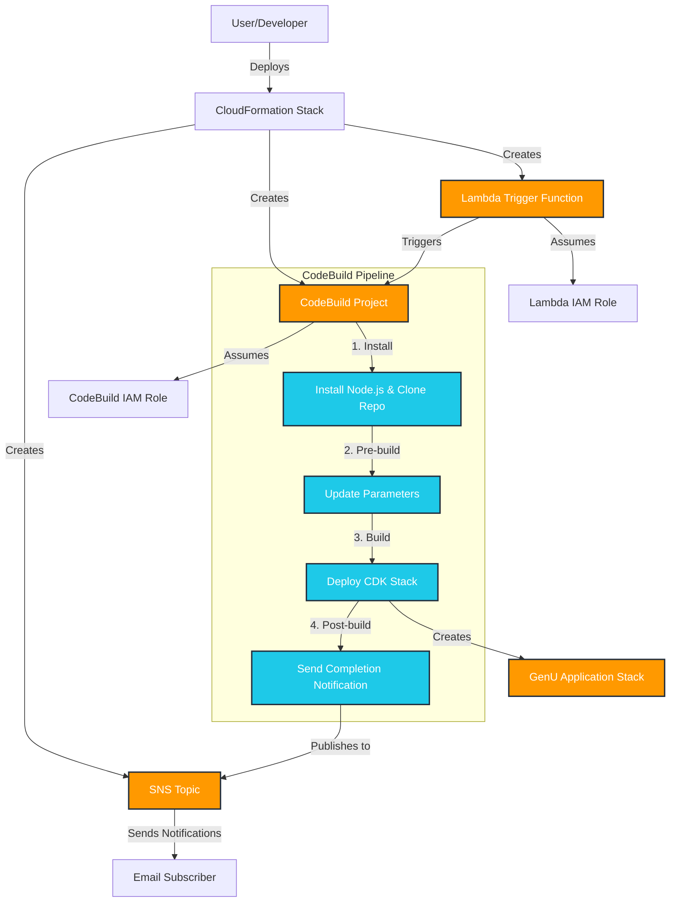

# AWS Generative AI Solution Box

本リポジトリでは、オープンソースで開発されている生成 AI の活用や開発に役立つアプリケーションを 1 click でデプロイする機能を提供します。様々なアプリケーションが動かせる AWS のプラットフォームとしての便利さを体感いただければ幸いです。

※本格的な開発やパラメーターのカスタマイズには開発環境が必要なことはご留意ください。

Web Site : https://aws-samples.github.io/sample-one-click-generative-ai-solutions/

## Generative AI Use Cases (GenU)

[Generative AI Use Cases](https://github.com/aws-samples/generative-ai-use-cases-jp) は、生成 AI の様々なユースケースがあらかじめ組み込まれたアプリケーションです。生成 AI の活用をこれから社内に普及するにあたり、安全かつ誰もが容易に使える環境を構築したい場合に最適です。

 [](https://ap-northeast-1.console.aws.amazon.com/cloudformation/home#/stacks/create/review?stackName=GenUDeploymentStack&templateURL=https://aws-ml-jp.s3.ap-northeast-1.amazonaws.com/asset-deployments/GenUDeploymentStack.yaml) 

### Parameters

ボタンを押すと次のパラメーターを設定できる画面に遷移します。

* Environment (default: dev)
   * デプロイする環境の種別です。`packages/cdk/parameter.ts` で指定する環境です。Environment の値を切り替えることで複数の GenU 環境をデプロイできます
* NotificationEmailAddress
   * デプロイの開始・終了を通知するメールアドレスです。
* ModelRegion
   * Amazon Bedrock のモデルを利用するリージョンです
* RAGEnabled (default: false)
   * Knowledge Base での RAG を有効化します
* SelfSignUp (default: false)
   * セルフサインアップの有効 / 無効を切り替えます。
* AllowedSignUpEmailDomains
   * カンマ区切りで利用可能なメールドメインを設定します
* AllowedIpV4AddressRanges
   * アクセス可能な IP アドレスを指定 (IPv4)
* AllowedIpV6AddressRanges
   * アクセス可能な IP アドレスを指定 (IPv6)

`AllowedIpV4AddressRanges` や `AllowedIpV6AddressRanges` を用いて、できるだけ IP 制限をかけることを推奨します。 IP 制限を書けない場合は Public Access 可能な状態でデプロイされますが、SelfSignUp は false にしているためログインには AWS アカウントでのユーザー作成 (Amazon Cognito) が必要です。

### デプロイ後のアップデートとパラメーター変更の手順
GenU を 1 click でデプロイしたあとに、GenU のアップデートやパラメーター変更を行う方法を紹介します。[詳細はこちらをご覧ください。](/docs/solutions/generative-ai-use-cases-update.md)


## Dify on AWS

[Dify](https://dify.ai/jp) は、生成 AI を用いたチャットボットやワークフローを GUI で作成することが出来ます。複数ステップにまたがる生成 AI の処理等を実装したい時に最適です。 AWS へのデプロイに当たっては [dify-self-hosted-on-aws](https://github.com/aws-samples/dify-self-hosted-on-aws) を使うことで容易に配置できます。

 [](https://us-east-1.console.aws.amazon.com/cloudformation/home#/stacks/create/review?stackName=DifyDeploymentStack&templateURL=https://aws-ml-jp.s3.ap-northeast-1.amazonaws.com/asset-deployments/DifyDeploymentStack.yaml)

### Parameters

* NotificationEmailAddress
   * デプロイの開始・終了を通知するメールアドレスです。
* Region
   * デプロイするリージョンです
* AutoPause
   * データベースの自動停止を ON / OFF にします。自動停止後は復旧に 10 秒程度かかります
* AllowedIpV4Ciders
   * 接続可能な IpV4 Cider です (0.0.0.0/1 など)
* AllowedIpV6Ciders
   * 接続可能な IpV6 Cider です (::/1 など)

## Bedrock Chat (BrChat)

[Bedrock Chat](https://github.com/aws-samples/bedrock-chat) は、Amazon Bedrock を活用した多言語対応の生成 AI プラットフォームです。シンプルなチャット機能だけでなく、ナレッジベース (RAG) を活用したカスタムボット作成、ボットストアを通じたボット共有、エージェント機能によるタスク自動化をサポートしています。生成 AI の特性を理解し、実践的に活用したい場合に最適です。

 [](https://us-east-1.console.aws.amazon.com/cloudformation/home#/stacks/create/review?stackName=BrChatDeploymentStack&templateURL=https://aws-ml-jp.s3.ap-northeast-1.amazonaws.com/asset-deployments/BrChatDeploymentStack.yaml)

### Parameters

* NotificationEmailAddress
   * デプロイの開始・終了を通知するメールアドレスです。
* BedrockRegion
   * Amazon Bedrock のモデルを利用するリージョンです（us-east-1, us-west-2, ap-northeast-1）
* SelfSignUp (default: false)
   * セルフサインアップの有効 / 無効を切り替えます。
* AllowedSignUpEmailDomains
   * カンマ区切りで利用可能なメールドメインを設定します
* AllowedIpV4AddressRanges
   * アクセス可能な IP アドレスを指定 (IPv4)
* AllowedIpV6AddressRanges
   * アクセス可能な IP アドレスを指定 (IPv6)
* EnableRagReplicas (default: false)
   * RAG データベースのレプリカを有効化します（可用性が向上しますがコストも増加します）
* Version (default: v3)
   * デプロイする Bedrock Chat のバージョンを指定します


## Technical Background

AWS で動く多くのアプリケーションは [AWS CDK](https://aws.amazon.com/jp/cdk/) で開発されています。CDK で構築されたアプリケーションを動かすには AWS 環境への接続設定や Node.js のセットアップなど開発に関する知識が必要で、技術的知見がない方が生成 AI を試すために設定するのは困難でした。そのため、こちらのリポジトリでは AWS アカウントさえあれば 1 click 、難しい場合でも 1 command でデプロイ・検証できる体験を提供します。

具体的には、CodeBuild を使用して CDK Deploy を行う構成を CloudFormation で作成し、必要なパラメーターを Cloud Formation から CodeBuild 側に引き渡しています。CloudFormation 自体は AWS のリソースを構築して終了するため、そのままでは CodeBuild が出来てもキックができません。そこで、CloudFormation の Custom Resource を使い自分自身が構築した CodeBuild をキックして終了するようにしています。アプリケーションの構築には時間がかかるため、開始 / 完了時に Amazon SNS で通知するようにしています。

### Overview



## Directory Structure

```
aws-generative-ai-asset-box/
├── build/           # CloudFormation templates and scripts for deployment
│   ├── genu/        
│   ├── bedrock-cc/  # Comming Soon
│   └── dify/        # Comming Soon
├── tests/           # Test for scripts
├── .venv/           # Python virtual environment (created by uv)
├── pyproject.toml   # Python project configuration
└── README.md        # This file
```

## Security

See [CONTRIBUTING](CONTRIBUTING.md#security-issue-notifications) for more information.

## License

This library is licensed under the MIT-0 License. See the LICENSE file.
