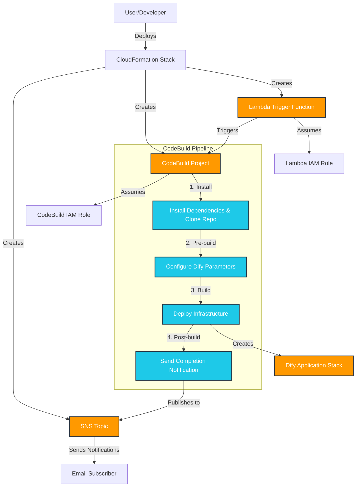

# Dify Self-Hosted on AWS Deployment Guide

Quick reference guide for deploying and managing the Dify CloudFormation template. We deploy `https://github.com/aws-samples/dify-self-hosted-on-aws` by CloudFormation file.



## Deployment

```bash
aws cloudformation create-stack \
  --stack-name DifyDeploymentProcess \
  --template-body file://DifyDeploymentProcess.yaml \
  --capabilities CAPABILITY_IAM CAPABILITY_NAMED_IAM \
  --parameters \
      ParameterKey=NotificationEmailAddress,ParameterValue=example@example.com \
      ParameterKey=Region,ParameterValue=us-east-1
```

**Note about capabilities**: The `--capabilities` flag is required to explicitly acknowledge that the template will create IAM resources. This is an AWS security requirement to prevent unintended IAM resource creation.

## Parameters

- **NotificationEmailAddress**: Email address to receive deployment notifications
- **Region**: Deployment region
- **AutoPause**: Enable Amazon Aurora auto pause 
- **AllowedIpV4Ciders**: Allowed IPv4 cider ranges for access
- **AllowedIpV6Ciders**: Allowed IPv6 cider ranges for access

## Monitor Deployment

```bash
aws cloudformation describe-stacks --stack-name DifyDeploymentProcess
aws cloudformation describe-stack-events --stack-name DifyDeploymentProcess
```

## Delete Stack

```bash
aws cloudformation delete-stack --stack-name DifyDeploymentProcess
```

## Debug

Validate template:
```bash
aws cloudformation validate-template --template-body file://DifyDeploymentProcess.yaml
```

Check CodeBuild logs in AWS Console if deployment fails during build phase.

## Test

Verify stack resources and outputs:
```bash
aws cloudformation list-stack-resources --stack-name DifyDeploymentProcess
aws cloudformation describe-stacks --stack-name DifyDeploymentProcess --query "Stacks[0].Outputs"
```
