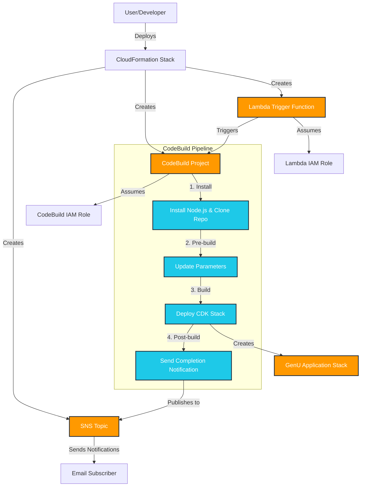

# Generative AI Use Cases JP (GenU) Deployment Guide

Quick reference guide for deploying and managing the GenU CloudFormation template.




## Deployment

```bash
aws cloudformation create-stack \
  --stack-name GenUDeploymentProcess \
  --template-body file://GenUDeploymentProcess.yaml \
  --capabilities CAPABILITY_IAM CAPABILITY_NAMED_IAM \
  --parameters \
      ParameterKey=NotificationEmailAddress,ParameterValue=example@example.co.jp \
      ParameterKey=Environment,ParameterValue=dev \
      ParameterKey=RAGEnabled,ParameterValue=false \
      ParameterKey=SelfSignUp,ParameterValue=true
```

**Note about capabilities**: Even though IAM roles and policies are defined in the CloudFormation template, the `--capabilities` flag is required to explicitly acknowledge that the template will create IAM resources. This is an AWS security requirement to prevent unintended IAM resource creation.

## Parameters

- **Environment**: Environment name (default: dev)
- **RAGEnabled**: Enable RAG in Knowledge Base (default: false)
- **SelfSignUp**: Enable self-signup (default: true)
- **AllowedSignUpEmailDomains**: Comma-separated allowed email domains
- **AllowedIpV4AddressRanges**: Allowed IPv4 ranges
- **AllowedIpV6AddressRanges**: Allowed IPv6 ranges

## Monitor Deployment

```bash
aws cloudformation describe-stacks --stack-name GenUDeploymentProcess
aws cloudformation describe-stack-events --stack-name GenUDeploymentProcess
```

## Delete Stack

```bash
aws cloudformation delete-stack --stack-name GenUDeploymentProcess
```

## Debug

Validate template:
```bash
aws cloudformation validate-template --template-body file://GenUDeploymentProcess.yaml
```

Check CodeBuild logs in AWS Console if deployment fails during build phase.

## Test

Verify stack resources and outputs:
```bash
aws cloudformation list-stack-resources --stack-name GenUDeploymentProcess
aws cloudformation describe-stacks --stack-name GenUDeploymentProcess --query "Stacks[0].Outputs"
```
