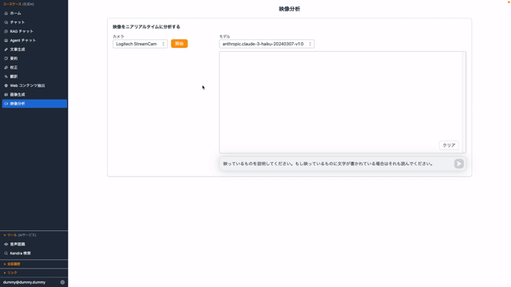
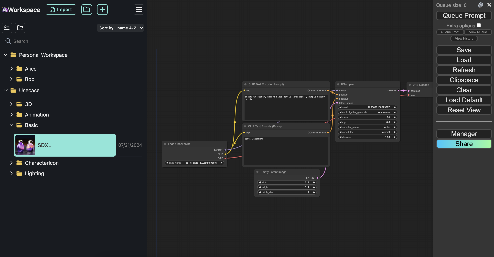

# Why AWS Generative AI Solution Box?

## Build generative AI applications easily, even without development experience

:zap: **Fast** : Build various generative AI solutions with one click  
:four_leaf_clover: **Easy-to-use** : Carefully selected solutions that even beginners can immediately experience the benefits  
:lock: **Secure** : Production-ready security for immediate production use  
:hammer: **Open-Source** : Each solution is open source and customizable  
:book: **Guide** : Provides usage instructions and guides for adoption  

## 3-Step Build Process

  

    
1

    
Login AWS

    
Create an AWS Account and login with deployment user

  

  

    
2

    
Choose & Click

    
Select the solution you want Click to start deployment

  

  

    
3

    
Start Journey

    
Start using when completion notification arrives

  

## 1. Prepare AWS Account

Please create an AWS account and sign in by referring to "Point 2: How to start using AWS?" in [6 Points for AWS Beginners](https://aws.amazon.com/local/aws-beginner-six-points/).

## 2. Choose & Click

Once you've decided on the AWS solution you want to use, select a region and click Deploy. If you need guides such as explanations of deployment options, please refer to the detailed documentation.

  <button class="filter-btn active" onclick="filterSolutions('all')">All</button>
  <button class="filter-btn" onclick="filterSolutions('popular')">🌟 Popular</button>
  <button class="filter-btn" onclick="filterSolutions('chat')">💬 Chat</button>
  <button class="filter-btn" onclick="filterSolutions('development')">🔧 Development</button>
  <button class="filter-btn" onclick="filterSolutions('creative')">🎨 Content Creation</button>
  <button class="filter-btn" onclick="filterSolutions('document')">📄 Document Analysis</button>

  

    

      
      
      
      
      
    

    

      
<a href="solutions/generative-ai-use-cases/">Generative AI Use Cases</a>

      

        

          <button class="solution-card__tag active" onclick="toggleDemo(this, 'chat')">Chat/RAG</button>
          <button class="solution-card__tag" onclick="toggleDemo(this, 'meeting')">Meeting</button>
          <button class="solution-card__tag" onclick="toggleDemo(this, 'image')">Image</button>
          <button class="solution-card__tag" onclick="toggleDemo(this, 'video')">Video</button>
          <button class="solution-card__tag" onclick="toggleDemo(this, 'builder')">Builder</button>
        

        <a href="https://github.com/aws-samples/generative-ai-use-cases-jp" target="_blank">Generative AI Use Cases</a> is an application with various generative AI use cases pre-built. It's ideal for building a safe and easy-to-use environment for everyone when promoting the adoption of generative AI within your organization.
      

    

  

  

    

      <select class="region-selector">
        <option value="ap-northeast-1">Tokyo</option>
        <option value="ap-northeast-3">Osaka</option>
        <option value="us-east-1">Virginia</option>
        <option value="us-west-2">Oregon</option>
      </select>
      <a href="https://ap-northeast-1.console.aws.amazon.com/cloudformation/home#/stacks/create/review?stackName=GenUDeploymentStack&templateURL=https://aws-ml-jp.s3.ap-northeast-1.amazonaws.com/asset-deployments/GenUDeploymentStack.yaml" class="deployment-button md-button" target="_blank">
        <i class="fa-solid fa-rocket"></i>　Deploy
      </a>
      <a href="https://ap-northeast-1.console.aws.amazon.com/cloudformation/home#/stacks/create/review?stackName=GenUDeploymentStack&amp;param_UsePreviousDeploymentParameter=true&amp;templateURL=https://aws-ml-jp.s3.ap-northeast-1.amazonaws.com/asset-deployments/GenUDeploymentStack.yaml" class="deployment-button md-button" target="_blank">
        <i class="fa-solid fa-sync"></i>　Update
      </a>
      <a href="solutions/generative-ai-use-cases/" class="detail-button">
        <i class="fa-solid fa-file-lines"></i>
        Details
      </a>
    

    

      <strong>Initial deployment:</strong> Use the Deploy button. 
      <strong>Updates after deployment:</strong> Use the Update button to inherit previous settings by entering only Environment and NotificationEmailAddress (leave others as default values). (<a href="solutions/generative-ai-use-cases-update/" target="_blank">Check detailed method</a>)
    

  

  

    

      
    

    

      
<a href="solutions/dify/">Dify</a>

      

        <a href="https://dify.ai" target="_blank">Dify</a> allows you to create chatbots and workflows using generative AI through a GUI. It's ideal when you want to implement multi-step generative AI processing. For AWS deployment, you can easily deploy using <a href="https://github.com/aws-samples/dify-self-hosted-on-aws" target="_blank">dify-self-hosted-on-aws</a>.
      

    

  

  

    

      <select class="region-selector">
        <option value="ap-northeast-1">Tokyo</option>
        <option value="ap-northeast-3">Osaka</option>
        <option value="us-east-1">Virginia</option>
        <option value="us-west-2">Oregon</option>
      </select>
      <a href="https://ap-northeast-1.console.aws.amazon.com/cloudformation/home#/stacks/create/review?stackName=DifyDeploymentStack&templateURL=https://aws-ml-jp.s3.ap-northeast-1.amazonaws.com/asset-deployments/DifyDeploymentStack.yaml" class="deployment-button md-button" target="_blank">
        <i class="fa-solid fa-rocket"></i>　Deploy
      </a>
      <a href="solutions/dify/" class="detail-button">
        <i class="fa-solid fa-file-lines"></i>
        Details
      </a>
    

  

  

    

      
    

    

      
<a href="solutions/brchat/">Bedrock Chat</a>

      

        <a href="https://github.com/aws-samples/bedrock-chat" target="_blank">Bedrock Chat</a> is a multilingual generative AI platform powered by Amazon Bedrock. It supports not only simple chat functionality but also custom bot creation using knowledge bases (RAG), bot sharing through a bot store, and task automation using agent functionality.
      

    

  

  

    

      <select class="region-selector">
        <option value="ap-northeast-1">Tokyo</option>
        <option value="ap-northeast-3">Osaka</option>
        <option value="us-east-1">Virginia</option>
        <option value="us-west-2">Oregon</option>
      </select>
      <a href="https://ap-northeast-1.console.aws.amazon.com/cloudformation/home#/stacks/create/review?stackName=BrChatDeploymentStack&templateURL=https://aws-ml-jp.s3.ap-northeast-1.amazonaws.com/asset-deployments/BrChatDeploymentStack.yaml" class="deployment-button md-button" target="_blank">
        <i class="fa-solid fa-rocket"></i>　Deploy
      </a>
      <a href="solutions/brchat/" class="detail-button">
        <i class="fa-solid fa-file-lines"></i>
        Details
      </a>
    

  

  

    

      
    

    

      
<a href="solutions/genai-design-studio/">GenAI Design Studio</a>

      

        <a href="https://github.com/aws-samples/sample-genai-design-studio" target="_blank">GenAI Design Studio</a> is a virtual try-on solution powered by Amazon Nova Canvas. It aims to streamline various processes in the apparel industry and e-commerce services, from fashion design to actual model photography.
      

    

  

  

    

      <select class="region-selector">
        <option value="ap-northeast-1">Tokyo</option>
        <option value="us-east-1">Virginia</option>
        <option value="eu-west-1">Ireland</option>
      </select>
      <a href="https://ap-northeast-1.console.aws.amazon.com/cloudformation/home#/stacks/create/review?stackName=GenStudioDeploymentStack&templateURL=https://aws-ml-jp.s3.ap-northeast-1.amazonaws.com/asset-deployments/GenStudioDeploymentStack.yaml" class="deployment-button md-button" target="_blank">
        <i class="fa-solid fa-rocket"></i>　Deploy
      </a>
      <a href="solutions/genai-design-studio/" class="detail-button">
        <i class="fa-solid fa-file-lines"></i>
        Details
      </a>
    

  

  

    

      
    

    

      
<a href="solutions/comfyui/">ComfyUI</a>

      

        <a href="https://github.com/comfyanonymous/ComfyUI" target="_blank">ComfyUI</a> is a node-based generative AI image generation tool that combines Stable Diffusion and various models to generate high-quality images. It's ideal for visually building complex workflows and having fine-grained control over the image generation process.
      

    

  

  

    

      <select class="region-selector">
        <option value="ap-northeast-1">Tokyo</option>
        <option value="ap-northeast-3">Osaka</option>
        <option value="us-east-1">Virginia</option>
        <option value="us-west-2">Oregon</option>
      </select>
      <a href="https://ap-northeast-1.console.aws.amazon.com/cloudformation/home#/stacks/create/review?stackName=ComfyUIDeploymentStack&templateURL=https://aws-ml-jp.s3.ap-northeast-1.amazonaws.com/asset-deployments/ComfyUIDeploymentStack.yaml" class="deployment-button md-button" target="_blank">
        <i class="fa-solid fa-rocket"></i>　Deploy
      </a>
      <a href="solutions/comfyui/" class="detail-button">
        <i class="fa-solid fa-file-lines"></i>
        Details
      </a>
    

  

  

    

      
    

    

      
<a href="solutions/rapid/">Review & Assessment Powered by Intelligent Documentation (RAPID)</a>

      

        <a href="https://github.com/aws-samples/review-and-assessment-powered-by-intelligent-documentation" target="_blank">RAPID</a> is a document review solution powered by generative AI (Amazon Bedrock). It streamlines review processes involving extensive documents and complex checklists using a Human in the Loop approach.
      

    

  

  

    

      <select class="region-selector">
        <option value="ap-northeast-1">Tokyo</option>
        <option value="us-west-2">Oregon</option>
        <option value="us-east-1">Virginia</option>
      </select>
      <a href="https://ap-northeast-1.console.aws.amazon.com/cloudformation/home#/stacks/create/review?stackName=RapidDeploymentStack&templateURL=https://aws-ml-jp.s3.ap-northeast-1.amazonaws.com/asset-deployments/RapidDeploymentStack.yaml" class="deployment-button md-button" target="_blank">
        <i class="fa-solid fa-rocket"></i>　Deploy
      </a>
      <a href="solutions/rapid/" class="detail-button">
        <i class="fa-solid fa-file-lines"></i>
        Details
      </a>
    

  

  

    

      
    

    

      
<a href="solutions/c360/">Customer 360 Data Fusion</a>

      

        <a href="https://github.com/aws-samples/sample-c360-text2sql-segmentation-entityresolution" target="_blank">Customer 360 Data Fusion</a> leverages AWS Entity Resolution to match and integrate customer data across different data sources, enabling natural language segment creation for comprehensive Customer 360 implementation.
      

    

  

  

    

      <select class="region-selector">
        <option value="us-east-1">Virginia</option>
        <option value="us-west-2">Oregon</option>
        <option value="ap-northeast-1">Tokyo</option>
      </select>
      <a href="https://us-east-1.console.aws.amazon.com/cloudformation/home#/stacks/create/review?stackName=C360DeploymentStack&templateURL=https://aws-ml-jp.s3.ap-northeast-1.amazonaws.com/asset-deployments/C360DeploymentStack.yaml" class="deployment-button md-button" target="_blank">
        <i class="fa-solid fa-rocket"></i>　Deploy
      </a>
      <a href="solutions/c360/" class="detail-button">
        <i class="fa-solid fa-file-lines"></i>
        Details
      </a>
    

  

  

    

      
    

    

      
<a href="solutions/bedrock-engineer/">Bedrock Engineer</a>

      

        <a href="https://github.com/aws-samples/bedrock-engineer" target="_blank">Bedrock Engineer</a> is an autonomous software development agent application powered by Amazon Bedrock. You can customize and use various features such as file creation/editing, command execution, web search, knowledge base utilization, multi-agent collaboration, and image generation.
      

    

  

  

    

      <a href="https://github.com/aws-samples/bedrock-engineer/releases/latest" class="download-button md-button" target="_blank">
        <i class="fa-solid fa-download"></i>　Download Latest Release
      </a>
      <a href="solutions/bedrock-engineer/" class="detail-button">
        <i class="fa-solid fa-file-lines"></i>
        Details
      </a>
    

  

  

    

      
    

    

      
<a href="solutions/remote-swe-agents/">Remote SWE Agents</a>

      

        <a href="https://github.com/aws-samples/remote-swe-agents" target="_blank">Remote SWE Agents</a> is an example implementation of a fully autonomous software development AI agent. This agent operates in a dedicated development environment for each task, performing development work without depending on the user's PC.
      

    

  

  

    

      <select class="region-selector">
        <option value="ap-northeast-1">Tokyo</option>
        <option value="us-west-2">Oregon</option>
        <option value="us-east-1">Virginia</option>
      </select>
      <a href="https://us-west-2.console.aws.amazon.com/cloudformation/home#/stacks/create/review?stackName=RemoteSweDeploymentStack&templateURL=https://aws-ml-jp.s3.ap-northeast-1.amazonaws.com/asset-deployments/RemoteSweDeploymentStack.yaml" class="deployment-button md-button" target="_blank">
        <i class="fa-solid fa-rocket"></i>　Deploy
      </a>
      <a href="solutions/remote-swe-agents/" class="detail-button">
        <i class="fa-solid fa-file-lines"></i>
        Details
      </a>
    

  

## 3. Start Journey

For Generative AI Use Cases, you can learn how to use it by following the next workshop.

* [Generative AI Experience Workshop](https://catalog.workshops.aws/generative-ai-use-cases-jp)
