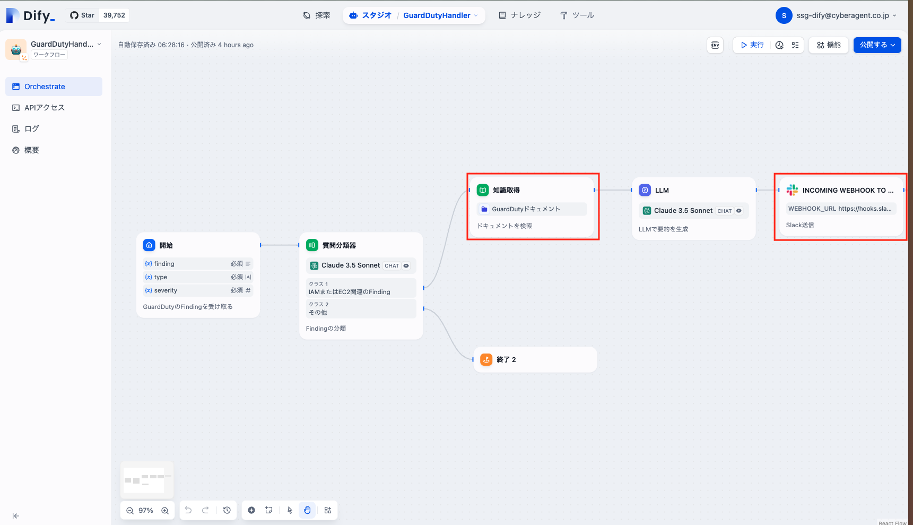
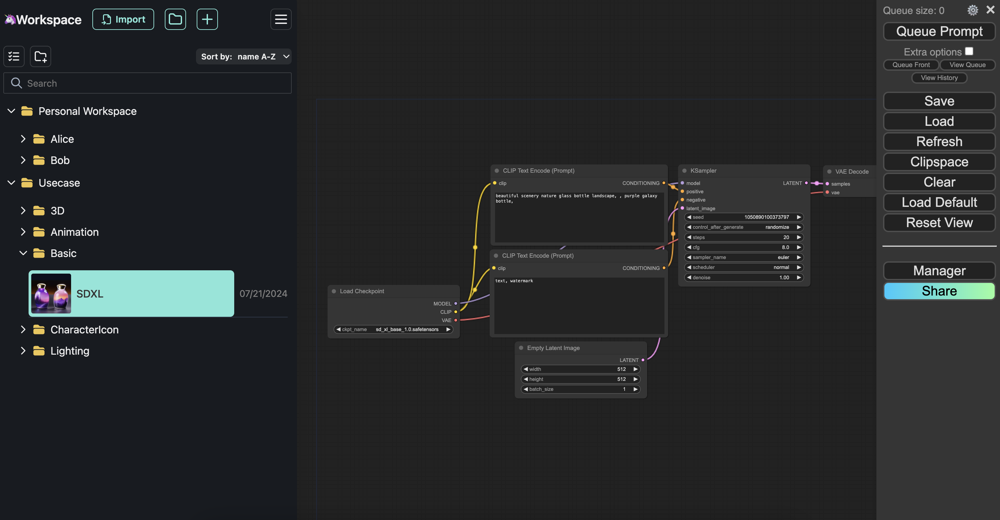
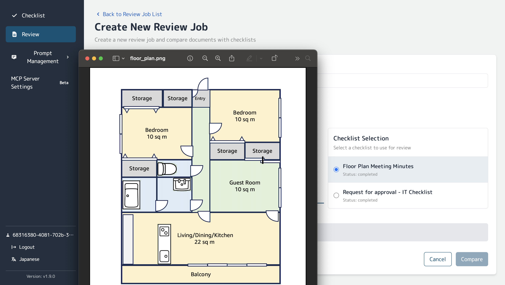
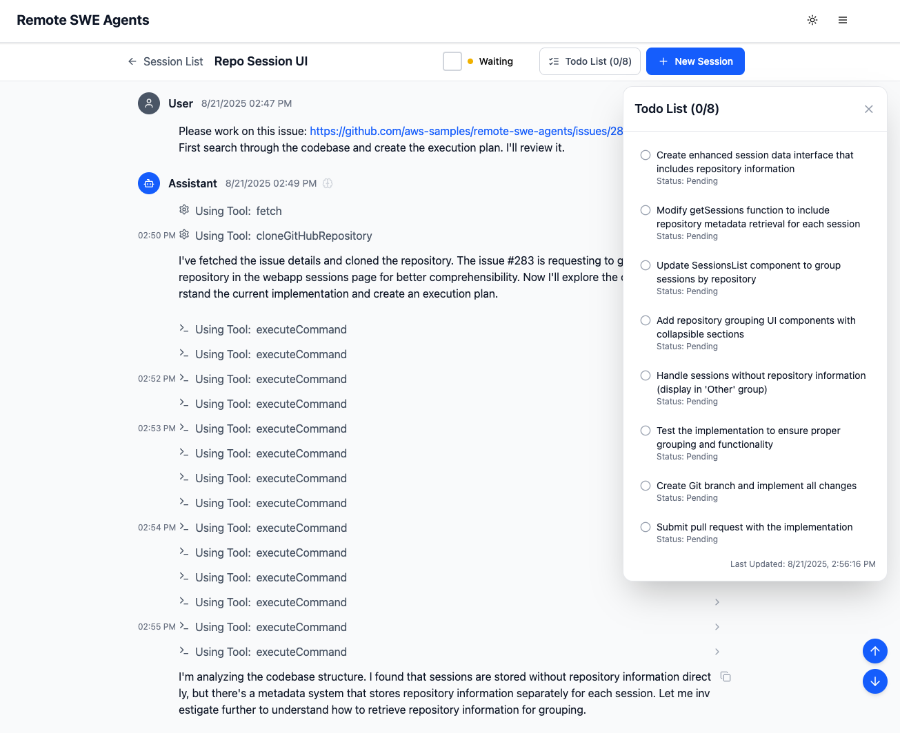

# Why AWS Generative AI Solution Box?

## 開発に慣れていなくても、簡単に生成 AI アプリケーションを構築

:zap: **Fast** : 生成 AI の様々なソリューションをワンクリックで構築  
:four_leaf_clover: **Easy-to-use** : 初心者でも効果をすぐに実感できるソリューションを厳選  
:lock: **Secure** : Production-Ready なセキュリティでそのまま本番利用が可能  
:hammer: **Open-Source** : 各ソリューションはオープンソースでカスタマイズ可能  
:book: **Guide** : 使用方法や普及のためのガイドを併せて提供  

## 3 Step の構築手順

  

    
1

    
Login AWS

    
AWS Account を作成し 構築用のユーザーでログイン

  

  

    
2

    
Choose & Click

    
使いたいソリューションを選択 クリックして構築開始

  

  

    
3

    
Start Journey

    
完成の通知が来たら使用開始

  

## 1. AWS Account の準備

[AWS を始めたい初心者向け 6 つのポイント](https://aws.amazon.com/jp/local/aws-beginner-six-points/) の "ポイントその２：AWS を使い始めるには？" を参考に AWS のアカウントを作成、サインインしてください。

## 2. Choose & Click

使いたい AWS のソリューションを決めたら、リージョンを選択し Deploy を Click します。デプロイのオプションについての説明などガイドが必要な場合は 詳しく を参照ください。

  <button class="filter-btn active" onclick="filterSolutions('all')">すべて</button>
  <button class="filter-btn" onclick="filterSolutions('popular')">🌟 人気</button>
  <button class="filter-btn" onclick="filterSolutions('chat')">💬 チャット・会話</button>
  <button class="filter-btn" onclick="filterSolutions('development')">🔧 開発・自動化</button>
  <button class="filter-btn" onclick="filterSolutions('creative')">🎨 コンテンツ制作</button>
  <button class="filter-btn" onclick="filterSolutions('document')">📄 文書分析</button>

  

    

      
      
      
      
      
    

    

      
Generative AI Use Cases

      

        

          <button class="solution-card__tag active" onclick="toggleDemo(this, 'chat')">Chat/RAG</button>
          <button class="solution-card__tag" onclick="toggleDemo(this, 'meeting')">Meeting</button>
          <button class="solution-card__tag" onclick="toggleDemo(this, 'image')">Image</button>
          <button class="solution-card__tag" onclick="toggleDemo(this, 'video')">Video</button>
          <button class="solution-card__tag" onclick="toggleDemo(this, 'builder')">Builder</button>
        

        <a href="https://github.com/aws-samples/generative-ai-use-cases-jp" target="_blank">Generative AI Use Cases</a> は、生成 AI の様々なユースケースがあらかじめ組み込まれたアプリケーションです。生成 AI の活用をこれから社内に普及するにあたり、安全かつ誰もが容易に使える環境を構築したい場合に最適です。
      

    

  

  

    

      <select class="region-selector">
        <option value="ap-northeast-1">東京</option>
        <option value="ap-northeast-3">大阪</option>
        <option value="us-east-1">バージニア</option>
        <option value="us-west-2">オレゴン</option>
      </select>
      <a href="https://ap-northeast-1.console.aws.amazon.com/cloudformation/home#/stacks/create/review?stackName=GenUDeploymentStack&templateURL=https://aws-ml-jp.s3.ap-northeast-1.amazonaws.com/asset-deployments/GenUDeploymentStack.yaml" class="deployment-button md-button" target="_blank">
        <i class="fa-solid fa-rocket"></i>　Deploy
      </a>
      <a href="https://ap-northeast-1.console.aws.amazon.com/cloudformation/home#/stacks/create/review?stackName=GenUDeploymentStack&amp;param_UsePreviousDeploymentParameter=true&amp;templateURL=https://aws-ml-jp.s3.ap-northeast-1.amazonaws.com/asset-deployments/GenUDeploymentStack.yaml" class="deployment-button md-button" target="_blank">
        <i class="fa-solid fa-sync"></i>　Update
      </a>
      <a href="solutions/generative-ai-use-cases/" class="detail-button">
        <i class="fa-solid fa-file-lines"></i>
        詳しく
      </a>
    

    

      <strong>初回デプロイ:</strong> Deploy ボタンを使用してください。 
      <strong>デプロイ後の更新:</strong> Update ボタンにより Environment、NotificationEmailAddress のみの入力 (他はデフォルト値のままで可) で前回の設定を引き継げます。(<a href="solutions/generative-ai-use-cases-update/" target="_blank">詳細な方法を確認</a>)
    

  

  

    

      
    

    

      
Dify

      

        <a href="https://dify.ai/jp" target="_blank">Dify</a> は、生成 AI を用いたチャットボットやワークフローを GUI で作成することが出来ます。複数ステップにまたがる生成 AI の処理等を実装したい時に最適です。 AWS へのデプロイに当たっては <a href="https://github.com/aws-samples/dify-self-hosted-on-aws" target="_blank">dify-self-hosted-on-aws</a>を使うことで容易に配置できます。
      

    

  

  

    

      <select class="region-selector">
        <option value="ap-northeast-1">東京</option>
        <option value="ap-northeast-3">大阪</option>
        <option value="us-east-1">バージニア</option>
        <option value="us-west-2">オレゴン</option>
      </select>
      <a href="https://ap-northeast-1.console.aws.amazon.com/cloudformation/home#/stacks/create/review?stackName=DifyDeploymentStack&templateURL=https://aws-ml-jp.s3.ap-northeast-1.amazonaws.com/asset-deployments/DifyDeploymentStack.yaml" class="deployment-button md-button" target="_blank">
        <i class="fa-solid fa-rocket"></i>　Deploy
      </a>
      <a href="solutions/dify/" class="detail-button">
        <i class="fa-solid fa-file-lines"></i>
        詳しく
      </a>
    

  

  

    

      
    

    

      
Bedrock Chat

      

        <a href="https://github.com/aws-samples/bedrock-chat" target="_blank">Bedrock Chat</a> は、Amazon Bedrock を活用した多言語対応の生成 AI プラットフォームです。シンプルなチャット機能だけでなく、ナレッジベース (RAG) を活用したカスタムボット作成、ボットストアを通じたボット共有、エージェント機能によるタスク自動化をサポートしています。
      

    

  

  

    

      <select class="region-selector">
        <option value="ap-northeast-1">東京</option>
        <option value="ap-northeast-3">大阪</option>
        <option value="us-east-1">バージニア</option>
        <option value="us-west-2">オレゴン</option>
      </select>
      <a href="https://ap-northeast-1.console.aws.amazon.com/cloudformation/home#/stacks/create/review?stackName=BrChatDeploymentStack&templateURL=https://aws-ml-jp.s3.ap-northeast-1.amazonaws.com/asset-deployments/BrChatDeploymentStack.yaml" class="deployment-button md-button" target="_blank">
        <i class="fa-solid fa-rocket"></i>　Deploy
      </a>
      <a href="solutions/brchat/" class="detail-button">
        <i class="fa-solid fa-file-lines"></i>
        詳しく
      </a>
    

  

  

    

      
    

    

      
GenAI Design Studio

      

        <a href="https://github.com/aws-samples/sample-genai-design-studio" target="_blank">GenAI Design Studio</a> は、Amazon Nova Canvas を活用したバーチャル試着ソリューションです。アパレル業界やECサービスにおいて、服飾デザインから実際のモデル着用撮影まで、様々なプロセスの効率化を目指します。
      

    

  

  

    

      <select class="region-selector">
        <option value="ap-northeast-1">東京</option>
        <option value="us-east-1">バージニア</option>
        <option value="eu-west-1">アイルランド</option>
      </select>
      <a href="https://ap-northeast-1.console.aws.amazon.com/cloudformation/home#/stacks/create/review?stackName=GenStudioDeploymentStack&templateURL=https://aws-ml-jp.s3.ap-northeast-1.amazonaws.com/asset-deployments/GenStudioDeploymentStack.yaml" class="deployment-button md-button" target="_blank">
        <i class="fa-solid fa-rocket"></i>　Deploy
      </a>
      <a href="solutions/genai-design-studio/" class="detail-button">
        <i class="fa-solid fa-file-lines"></i>
        詳しく
      </a>
    

  

  

    

      
    

    

      
ComfyUI

      

        <a href="https://github.com/comfyanonymous/ComfyUI" target="_blank">ComfyUI</a> は、ノードベースの生成AI画像生成ツールで、Stable Diffusion や様々なモデルを組み合わせて高品質な画像を生成できます。複雑なワークフローを視覚的に構築し、画像生成プロセスを細かく制御したい場合に最適です。
      

    

  

  

    

      <select class="region-selector">
        <option value="ap-northeast-1">東京</option>
        <option value="ap-northeast-3">大阪</option>
        <option value="us-east-1">バージニア</option>
        <option value="us-west-2">オレゴン</option>
      </select>
      <a href="https://ap-northeast-1.console.aws.amazon.com/cloudformation/home#/stacks/create/review?stackName=ComfyUIDeploymentStack&templateURL=https://aws-ml-jp.s3.ap-northeast-1.amazonaws.com/asset-deployments/ComfyUIDeploymentStack.yaml" class="deployment-button md-button" target="_blank">
        <i class="fa-solid fa-rocket"></i>　Deploy
      </a>
      <a href="solutions/comfyui/" class="detail-button">
        <i class="fa-solid fa-file-lines"></i>
        詳しく
      </a>
    

  

  

    

      
    

    

      
Review & Assessment Powered by Intelligent Documentation (RAPID)

      

        <a href="https://github.com/aws-samples/review-and-assessment-powered-by-intelligent-documentation" target="_blank">RAPID</a> は、生成 AI (Amazon Bedrock) を活用した書類審査ソリューションです。膨大な書類と複雑なチェックリストによる審査業務を、Human in the Loop アプローチで効率化します。
      

    

  

  

    

      <select class="region-selector">
        <option value="ap-northeast-1">東京</option>
        <option value="us-west-2">オレゴン</option>
        <option value="us-east-1">バージニア</option>
      </select>
      <a href="https://ap-northeast-1.console.aws.amazon.com/cloudformation/home#/stacks/create/review?stackName=RapidDeploymentStack&templateURL=https://aws-ml-jp.s3.ap-northeast-1.amazonaws.com/asset-deployments/RapidDeploymentStack.yaml" class="deployment-button md-button" target="_blank">
        <i class="fa-solid fa-rocket"></i>　Deploy
      </a>
      <a href="solutions/rapid/" class="detail-button">
        <i class="fa-solid fa-file-lines"></i>
        詳しく
      </a>
    

  

  

    

      
    

    

      
Bedrock Engineer

      

        <a href="https://github.com/aws-samples/bedrock-engineer" target="_blank">Bedrock Engineer</a> は、Amazon Bedrock を活用した自律型ソフトウェア開発エージェントアプリケーションです。ファイル作成・編集、コマンド実行、Web 検索、ナレッジベース活用、マルチエージェント連携、画像生成など、様々な機能をカスタマイズして利用できます。
      

    

  

  

    

      <a href="https://github.com/aws-samples/bedrock-engineer/releases/latest" class="download-button md-button" target="_blank">
        <i class="fa-solid fa-download"></i>　Download Latest Release
      </a>
      <a href="solutions/bedrock-engineer/" class="detail-button">
        <i class="fa-solid fa-file-lines"></i>
        詳しく
      </a>
    

  

  

    

      
    

    

      
Remote SWE Agents

      

        <a href="https://github.com/aws-samples/remote-swe-agents" target="_blank">Remote SWE Agents</a> は、AI による自律型のソフトウェア開発エージェントの実装例です。このエージェントはタスクごとに専用の開発環境内で動作し、ユーザーの PC に依存することなく開発作業を行います。
      

    

  

  

    

      <select class="region-selector">
        <option value="ap-northeast-1">東京</option>
        <option value="us-west-2">オレゴン</option>
        <option value="us-east-1">バージニア</option>
      </select>
      <a href="https://us-west-2.console.aws.amazon.com/cloudformation/home#/stacks/create/review?stackName=RemoteSweDeploymentStack&templateURL=https://aws-ml-jp.s3.ap-northeast-1.amazonaws.com/asset-deployments/RemoteSweDeploymentStack.yaml" class="deployment-button md-button" target="_blank">
        <i class="fa-solid fa-rocket"></i>　Deploy
      </a>
      <a href="solutions/remote-swe-agents/" class="detail-button">
        <i class="fa-solid fa-file-lines"></i>
        詳しく
      </a>
    

  

## 3. Start Journey

Generative AI Use Cases については、次のワークショップを進めることで使い方を学ぶことが出来ます。

* [生成 AI 体験ワークショップ](https://catalog.workshops.aws/generative-ai-use-cases-jp)
