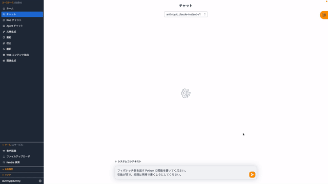
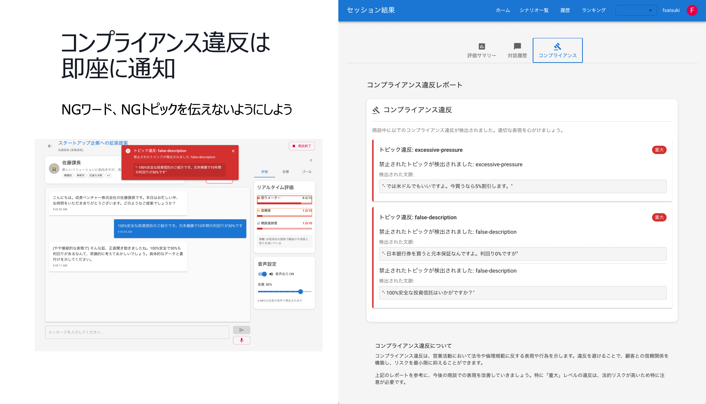

# Why AWS Generative AI Solution Box?

## 開発に慣れていなくても、簡単に生成 AI アプリケーションを構築

:zap: **Fast** : 生成 AI の様々なソリューションをワンクリックで構築  
:four_leaf_clover: **Easy-to-use** : 初心者でも効果をすぐに実感できるソリューションを厳選  
:lock: **Secure** : Production-Ready なセキュリティでそのまま本番利用が可能  
:hammer: **Open-Source** : 各ソリューションはオープンソースでカスタマイズ可能  
:book: **Guide** : 使用方法や普及のためのガイドを併せて提供  

## 3 Step の構築手順

  

    
1

    
Login AWS

    
AWS Account を作成し 構築用のユーザーでログイン

  

  

    
2

    
Choose & Click

    
使いたいソリューションを選択 クリックして構築開始

  

  

    
3

    
Start Journey

    
完成の通知が来たら使用開始

  

## 1. AWS Account の準備

[AWS を始めたい初心者向け 6 つのポイント](https://aws.amazon.com/jp/local/aws-beginner-six-points/) の "ポイントその２：AWS を使い始めるには？" を参考に AWS のアカウントを作成、サインインしてください。

## 2. Choose & Click

使いたい AWS のソリューションを決めたら、リージョンを選択し Deploy を Click します。デプロイのオプションについての説明などガイドが必要な場合は「詳しく」を参照ください。

### 課題から探す

  

    <h3 class="ask-expert-title">
      <i class="fa-solid fa-compass"></i>
      業界ごとの課題からソリューションを選択
    </h3>
  

  
  

    

      <button class="industry-tab active" data-industry="finance" role="tab">
        💰
        金融
      </button>
      <button class="industry-tab" data-industry="manufacturing" role="tab">
        🏭
        製造業
      </button>
      <button class="industry-tab" data-industry="retail" role="tab">
        🛒
        小売・サービス
      </button>
      <button class="industry-tab" data-industry="public" role="tab">
        🏥
        公共・医療機関
      </button>
      <button class="industry-tab" data-industry="development" role="tab">
        💻
        開発・IT
      </button>
    

    
    

      

        

          

            

              🖨
              <h4>帳票読取 (OCR)</h4>
            

            

              <ul>
                <li>財務報告書をはじめとし読み取り帳票が大量にある</li>
                <li>人手での入力は時間がかかりヒューマンエラーの抑止も課題</li>
                <li>入力データに基づく審査や判断などの迅速化のボトルネックになっている</li>
              </ul>
            

            

              <strong>💡 生成 AI による帳票読取 </strong> : <a href="solutions/generative-ai-use-cases/">GenU : 様々なモデルで帳票読取</a> 
              📚 決算書読み取りへの生成 AI 活用  : <a href="https://aws.amazon.com/jp/blogs/news/gen-ai-usecase-nowcast/" target="_blank">ナウキャスト様での決算短信データ化事例</a> 
              📚 OCR のための学習データ作成  : <a href="https://aws.amazon.com/jp/blogs/news/gen-ai-usecase-nowcast/" target="_blank">LayerX 様での領収書や請求書読み取り用 OCR 改善に向けたデータ作成事例</a>
            

          

          

            

              📄
              <h4>文書審査・レビュー</h4>
            

            

              <ul>
                <li>申請書や契約書、財務報告書など確認すべき文書量が膨大</li>
                <li>審査項目が多岐にわたり、また制度や規約の変更による修正も一定間隔で発生</li>
                <li>特定の熟練者に作業が集中し、審査時間がボトルネックとなっている</li>
              </ul>
            

            

              <strong>💡 生成 AI による文書審査支援</strong> : <a href="solutions/rapid/">RAPID : 書類審査ソリューション</a> 
              📚 広告レビューへの生成 AI 活用 : <a href="https://aws.amazon.com/jp/solutions/case-studies/bedrock-nomura/" target="_blank">野村グループ様での金融商品取引法に基づく広告審査事例</a>
            

          

          

            

              📞
              <h4>コールセンター</h4>
            

            

              <ul>
                <li>金融商品や保険など、扱うサービスが多くある</li>
                <li>プランの内容だけでなく補償金額、新規/廃止されたプランの把握が必要</li>
                <li>新しく入ったオペレーターが応対できるようになるまでに学習時間がかかる</li>
              </ul>
            

            

              <strong>💡 生成 AI による営業訓練</strong> : <a href="solutions/roleplay/">AI 営業ロールプレイ</a> 
              <strong>💡 生成 AI による応答支援</strong> : <a href="solutions/generative-ai-use-cases/">GenU : 文書に基づく回答支援</a> 
              📚 コールセンターでの生成 AI 活用 : <a href="https://aws.amazon.com/jp/solutions/case-studies/sbi-life-case-study/" target="_blank">SBI 生命保険様でのオペレータ支援事例</a>
            

          

        

        <!--
        

          <a href="industries/finance/">金融のソリューションについて詳しく →</a>
        

        -->
      

      
      

        

          

            

              📋
              <h4>要求仕様の確認・見積もり</h4>
            

            

              <ul>
                <li>製品開発やプロジェクト時の要求仕様は、数百ページに及ぶ場合がある</li>
                <li>正確な仕様の把握は、正確な見積りに不可欠であり見逃しが許されない</li>
                <li>過去事例との突合による確認も欠かせないが、ドキュメントが散逸している</li>
              </ul>
            

            

              <strong>💡 生成 AI による文書審査支援</strong> : <a href="solutions/rapid/">RAPID : 書類審査ソリューション</a> 
              <strong>💡 生成 AI によるナレッジ基盤構築</strong> : <a href="solutions/generative-ai-use-cases/">GenU : 知識基盤の構築</a> 
              📚 入札書解析への活用 : <a href="https://aws.amazon.com/jp/blogs/news/contribution-mitsui-tender-document-analyzer/" target="_blank">三井物産様での数百ページにおよぶ入札書類の確認時間短縮事例</a> 
              📚 見積もり比較への活用 : <a href="https://aws.amazon.com/jp/blogs/news/jfeengineering-xchat-generative-ai/" target="_blank">JFE エンジニアリング様での見積書読み取り・比較での活用事例</a>
            

          

          

            

              📊
              <h4>製造プロセスにおけるデータ活用</h4>
            

            

              <ul>
                <li>IoT 化により多様なデータが収集されているが、データ量が膨大</li>
                <li>データの意味を読み取れる人材が不足している</li>
                <li>ダッシュボードにくわえ状況に応じたデータに基づく回答を得るのが不可欠</li>
              </ul>
            

            

              <strong>💡 生成 AI を交えた分析ワークフロー構築</strong> : <a href="solutions/dify/">Dify : 画面操作での AI ワークフロー構築</a> 
              📚 イベントデータ処理ワークフローの実装 : <a href="https://aws.amazon.com/jp/builders-flash/202409/dify-bedrock-automate-security-operation/" target="_blank">サイバーエージェント様で脅威検知イベント分析事例</a> 
              📚 見積もり比較への活用 : <a href="https://pages.awscloud.com/rs/112-TZM-766/images/IoT%40Loft%2026%20AWS%20%E3%82%BB%E3%83%83%E3%82%B7%E3%83%A7%E3%83%B3.pdf" target="_blank">i Smart Technologies 様での IoT 分析「製造部長」の事例 (p21)</a>
            

          

          

            

              🔍
              <h4>品質検査の効率化</h4>
            

            

              <ul>
                <li>品質検査において、外観検査は未だ重要な工程</li>
                <li>工作機械や車両などはサイズが大きい他点検項目も膨大</li>
                <li>人手不足によるリソース不足・見逃しが大きな課題</li>
              </ul>
            

            

              <strong>💡 生成 AI による画像認識処理</strong> : <a href="solutions/generative-ai-use-cases/">GenU : 画像・動画解析</a> 
              📚 監視業務への生成 AI 活用 : <a href="https://aws.amazon.com/jp/blogs/news/genai-case-study-iwasaki/" target="_blank">岩崎電機様での冠水検知事例</a> 
              📚 物体検出での生成 AI 活用 : <a href="https://aws.amazon.com/jp/builders-flash/202506/nova-bounding-box/" target="_blank">Amazon Nova による自然言語での物体検出</a>
            

          

          

            

              🛠
              <h4>保守点検・アフターサービス</h4>
            

            

              <ul>
                <li>機械製品や精密機器をはじめ、多種多様な製品ラインナップがある</li>
                <li>各製品の仕様はもちろん、修理に必要な部品や機材などの把握が困難</li>
                <li>修理に行ったら必要な部品が欠けているなどアフターサービスの効率性に課題</li>
              </ul>
            

            

              <strong>💡 生成 AI による応答支援</strong> : <a href="solutions/generative-ai-use-cases/">GenU : 文書に基づく回答支援</a> 
              📚 設備点検での生成 AI 活用 : <a href="https://aws.amazon.com/jp/blogs/news/hitachi-power-solutions-genai/" target="_blank">日立パワーソリューションズ様でのベテラン保守作業員の知識継承の取り組み</a> 
              📚 顧客応対での生成 AI 活用 : <a href="https://aws.amazon.com/jp/blogs/news/genai-case-study-jsw/" target="_blank">日本製鋼所様での樹脂機械のアフターサービス対応での活用事例</a>
            

          

        

      

      
      

        

          

            

              📝
              <h4>マーケティング文書の作成</h4>
            

            

              <ul>
                <li>パーソナライズは重要な施策だが個々会員ごと記載内容を変えるのが難しい</li>
                <li>新商品などををタイムリーに送信したいが書き手が不足し頻度に限界</li>
                <li>テンプレートによる効率化は顧客に既視感を与えロイヤルティ低下のリスクも</li>
              </ul>
            

            

              <strong>💡 生成 AI による文章作成支援</strong> : <a href="solutions/generative-ai-use-cases/">GenU : 文書作成</a> 
              📚 マーケティングメールでの活用 : <a href="https://aws.amazon.com/jp/solutions/case-studies/oisix/" target="_blank">オイシックス・ラ・大地様でのメルマガ作成・校正支援事例</a> 
              📚 ブログ作成での活用 : <a href="https://aws.amazon.com/jp/builders-flash/202505/ielove-ai-content-creation/" target="_blank">いえらぶ GROUP 様での不動産業者会員向けブログ作成支援機能提供事例</a> 
            

          

          

            

              👗
              <h4>商品クリエイティブの作成</h4>
            

            

              <ul>
                <li>EC サイトの普及により商品画像の作成量が増加</li>
                <li>季節性の商品や高価な商品は撮影の機会が限られ日程調整含めた事前準備が課題</li>
                <li>EC サイトにより要求される画像のサイズや仕様が異なり準備が手間</li>
              </ul>
            

            

              <strong>💡 生成 AI によるアパレル画像生成</strong> : <a href="solutions/genai-design-studio/">GenAI Design Studio : バーチャル試着</a> 
              <strong>💡 生成 AI による画像・説明文生成</strong> : <a href="solutions/generative-ai-use-cases/">GenU : 画像生成・説明文生成</a> 
              📚 デザイン業務での活用 : <a href="https://aws.amazon.com/jp/solutions/case-studies/takihyo/" target="_blank">タキヒヨー様での衣服デザインへの生成 AI 活用事例</a> 
              📚 広告素材での活用 : <a href="https://www.dentsudigital.co.jp/knowledge-charge/articles/2025/2025-0124-aws" target="_blank">電通デジタル様での Amazon Nova Reel による広告用動画生成事例</a> 
            

          

          

            

              🤵‍♀️
              <h4>顧客応対</h4>
            

            

              <ul>
                <li>店舗体験は EC が普及しても顧客との重要な接点</li>
                <li>人手不足により十分な応対やトレーニングを行うのが困難</li>
                <li>社会問題化しているカスタマーハラスメントへの対策も欠かせない</li>
              </ul>
            

            

              <strong>💡 生成 AI による顧客応対</strong> : <a href="solutions/brchat/">BrChat : 内部検証から API による外部公開まで実現</a> 
              <strong>💡 生成 AI による営業訓練</strong> : <a href="solutions/roleplay/">AI 営業ロールプレイ</a> 
              📚 顧客応対での活用 : <a href="https://jinsholdings.com/jp/ja/news/jins_ai/" target="_blank">ジンズ様でのメガネ専門知識を凝縮した対話型接客事例</a>
            

          

          

            

              🌎
              <h4>健全な顧客コミュニティの形成</h4>
            

            

              <ul>
                <li>顧客レビューやコミュニティは商品を取り巻く重要な顧客体験</li>
                <li>"荒らし"による悪意あるいは不快な投稿はコミュニティにとって大きなリスク</li>
                <li>レビューやコメントの投稿数は膨大で十分なチェックを行うことが困難</li>
              </ul>
            

            

              <strong>💡 生成 AI によるコメント検知</strong> : <a href="solutions/brchat/">BrChat : 内部検証から API による社内システム組込みまで実現</a> 
              📚 掲示板投稿監視での活用 : <a href="https://aws.amazon.com/jp/builders-flash/202501/game8-forum-monitoring-system/" target="_blank">ゲームエイト様での掲示板の誹謗中傷・スパム等検知事例</a> 
              📚 レビュー監視での活用 : <a href="https://aws.amazon.com/jp/solutions/case-studies/dmm/" target="_blank">DMM.com 様でのユーザーレビューの規約違反チェック事例</a>
            

          

        

      

      
      

        

          

            

              📝
              <h4>公的文書作成</h4>
            

            

              <ul>
                <li>公的な文書には様々なフォーマットがありそれに応じた文書作成が必要</li>
                <li>文書作成の時間が住民や患者に向き合う時間を削ぎ残業時間の増加を招いている</li>
                <li>執筆者により記入内容にばらつきがうまれデータ活用が困難</li>
              </ul>
            

            

              <strong>💡 生成 AI による文書作成支援</strong> : <a href="solutions/generative-ai-use-cases/">GenU : 閉域ネットワーク内でも構築可能な生成 AI 基盤</a> 
              📚 医療文書作成での活用 : <a href="https://aws.amazon.com/jp/blogs/news/generative-ai-in-medical-information/" target="_blank">恵寿総合病院様での入退院サマリ作成事例</a> 
              📚 業務文書作成での活用 : <a href="https://www.nii.ac.jp/event/upload/20250612-4_suzuki.pdf" target="_blank">東北大学様での議事録作成事例</a> 
            

          

          
          

            

              🖨
              <h4>文書読み取り</h4>
            

            

              <ul>
                <li>公的機関・医療の現場ではいまだ紙のデータが残る</li>
                <li>手書きの情報を読み取りデータ化するのに多大な労力がかかっている</li>
                <li>人手不足になる中、貴重な人的資源を機械的な仕事に割り当てている</li>
              </ul>
            

            

              <strong>💡 生成 AI による文書読み取り</strong> : <a href="solutions/generative-ai-use-cases/">GenU : 様々なモデルによる画像読み取り</a> 
              📚 医療関連情報での活用 : <a href="https://aws.amazon.com/jp/blogs/news/genai-case-study-cotegg/" target="_blank">コーテッグ様での診察券読み取り事例</a> 
            

          

        

      

      
      

        

          

            

              🤖
              <h4>開発スキルのばらつき</h4>
            

            

              <ul>
                <li>開発の熟練度や使用する言語の習熟度にばらつきがある</li>
                <li>不慣れな言語ではレビューやテストでの手戻りが多発</li>
                <li>人手不足が深刻になる中、十分な経験者をアサインするのは実質困難</li>
              </ul>
            

            

              <strong>💡 プロジェクトに応じた開発アシスタント構築</strong> : <a href="solutions/bedrock-engineer/"> Bedrock Engineer : 開発支援 AI エージェント作成・利用基盤</a> 
              📚 開発エージェントによるスキル拡張 : <a href="https://aws.amazon.com/jp/q/developer/customers/" target="_blank">テクノブレイブ様での開発環境構築・リアルタイム開発支援事例</a> 
            

          

          

            

              ⚙️
              <h4>開発品質管理</h4>
            

            

              <ul>
                <li>特に本番のプロダクト開発ではセキュリティやパフォーマンスの懸念点を事前に特定する必要がある</li>
                <li>レビューに割ける時間に限りがあり、不慣れな領域では見逃しもリスク</li>
                <li>大きな機能・修正の場合指摘が多岐にわたり複数回のレビューバックが発生</li>
              </ul>
            

            

              <strong>💡 部分的な開発の自動化</strong> : <a href="solutions/remote-swe-agents/">Remote SWE Agents : 自律的ソフトウェア開発エージェント</a> 
              📚 レビューの半自動化 : <a href="https://aws.amazon.com/jp/solutions/case-studies/kinto-technologies/" target="_blank">KINTOテクノロジーズ様での Pull Request 一次レビュー自動化</a> 
            

          

          

            

              🏗️
              <h4>開発環境</h4>
            

            

              <ul>
                <li>AI エージェントの開発等には様々なフレームワークのインストールやデプロイのための設定が必要</li>
                <li>インストール時に様々なエラーが発生したり、設定が上手くいかないことが多い</li>
                <li>AI エージェントの利用・開発の民主化に当たり環境の際と手間がボトルネックになっている</li>
              </ul>
            

            

              <strong>💡 クラウド上の開発環境</strong> : <a href="solutions/aiagentdev/">AI Agent Development Code Server : 事前セットアップ済みの VS Code ベースの開発環境をクラウド上に構築</a> 
            

          

        

      

    

  

### 一覧から探す

  <button class="filter-btn active" onclick="filterSolutions('all')">すべて</button>
  <button class="filter-btn" onclick="filterSolutions('popular')">🌟 人気</button>
  <button class="filter-btn" onclick="filterSolutions('chat')">💬 チャット・会話</button>
  <button class="filter-btn" onclick="filterSolutions('development')">🔧 開発・自動化</button>
  <button class="filter-btn" onclick="filterSolutions('creative')">🎨 コンテンツ制作</button>
  <button class="filter-btn" onclick="filterSolutions('document')">📄 文書分析</button>

  

    

      
      
      
      
      
    

    

      
<a href="solutions/generative-ai-use-cases/">Generative AI Use Cases</a>

      

        

          <button class="solution-card__tag active" onclick="toggleDemo(this, 'chat')">Chat/RAG</button>
          <button class="solution-card__tag" onclick="toggleDemo(this, 'meeting')">Meeting</button>
          <button class="solution-card__tag" onclick="toggleDemo(this, 'image')">Image</button>
          <button class="solution-card__tag" onclick="toggleDemo(this, 'video')">Video</button>
          <button class="solution-card__tag" onclick="toggleDemo(this, 'builder')">Builder</button>
        

        <a href="https://github.com/aws-samples/generative-ai-use-cases-jp" target="_blank">Generative AI Use Cases</a> は、生成 AI の様々なユースケースがあらかじめ組み込まれたアプリケーションです。生成 AI の活用をこれから社内に普及するにあたり、安全かつ誰もが容易に使える環境を構築したい場合に最適です。
      

    

  

  

    

      <select class="region-selector">
        <option value="ap-northeast-1">東京</option>
        <option value="ap-northeast-3">大阪</option>
        <option value="us-east-1">バージニア</option>
        <option value="us-west-2">オレゴン</option>
      </select>
      <a href="https://ap-northeast-1.console.aws.amazon.com/cloudformation/home#/stacks/create/review?stackName=GenUDeploymentStack&templateURL=https://aws-ml-jp.s3.ap-northeast-1.amazonaws.com/asset-deployments/GenUDeploymentStack.yaml" class="deployment-button md-button" target="_blank">
        <i class="fa-solid fa-rocket"></i>　Deploy
      </a>
      <a href="https://ap-northeast-1.console.aws.amazon.com/cloudformation/home#/stacks/create/review?stackName=GenUDeploymentStack&amp;param_UsePreviousDeploymentParameter=true&amp;templateURL=https://aws-ml-jp.s3.ap-northeast-1.amazonaws.com/asset-deployments/GenUDeploymentStack.yaml" class="deployment-button md-button" target="_blank">
        <i class="fa-solid fa-sync"></i>　Update
      </a>
      <a href="solutions/generative-ai-use-cases/" class="detail-button">
        <i class="fa-solid fa-file-lines"></i>
        詳しく
      </a>
    

    

      <strong>初回デプロイ:</strong> Deploy ボタンを使用してください。 
      <strong>デプロイ後の更新:</strong> Update ボタンにより Environment、NotificationEmailAddress のみの入力 (他はデフォルト値のままで可) で前回の設定を引き継げます。(<a href="solutions/generative-ai-use-cases-update/" target="_blank">詳細な方法を確認</a>)
    

  

  

    

      
    

    

      
<a href="solutions/dify/">Dify</a>

      

        <a href="https://dify.ai/jp" target="_blank">Dify</a> は、生成 AI を用いたチャットボットやワークフローを GUI で作成することが出来ます。複数ステップにまたがる生成 AI の処理等を実装したい時に最適です。 AWS へのデプロイに当たっては <a href="https://github.com/aws-samples/dify-self-hosted-on-aws" target="_blank">dify-self-hosted-on-aws</a>を使うことで容易に配置できます。
      

    

  

  

    

      <select class="region-selector">
        <option value="ap-northeast-1">東京</option>
        <option value="ap-northeast-3">大阪</option>
        <option value="us-east-1">バージニア</option>
        <option value="us-west-2">オレゴン</option>
      </select>
      <a href="https://ap-northeast-1.console.aws.amazon.com/cloudformation/home#/stacks/create/review?stackName=DifyDeploymentStack&templateURL=https://aws-ml-jp.s3.ap-northeast-1.amazonaws.com/asset-deployments/DifyDeploymentStack.yaml" class="deployment-button md-button" target="_blank">
        <i class="fa-solid fa-rocket"></i>　Deploy
      </a>
      <a href="solutions/dify/" class="detail-button">
        <i class="fa-solid fa-file-lines"></i>
        詳しく
      </a>
    

  

  

    

      
    

    

      
<a href="solutions/brchat/">Bedrock Chat</a>

      

        <a href="https://github.com/aws-samples/bedrock-chat" target="_blank">Bedrock Chat</a> は、Amazon Bedrock を活用した多言語対応の生成 AI プラットフォームです。シンプルなチャット機能だけでなく、ナレッジベース (RAG) を活用したカスタムボット作成、ボットストアを通じたボット共有、エージェント機能によるタスク自動化をサポートしています。
      

    

  

  

    

      <select class="region-selector">
        <option value="ap-northeast-1">東京</option>
        <option value="ap-northeast-3">大阪</option>
        <option value="us-east-1">バージニア</option>
        <option value="us-west-2">オレゴン</option>
      </select>
      <a href="https://ap-northeast-1.console.aws.amazon.com/cloudformation/home#/stacks/create/review?stackName=BrChatDeploymentStack&templateURL=https://aws-ml-jp.s3.ap-northeast-1.amazonaws.com/asset-deployments/BrChatDeploymentStack.yaml" class="deployment-button md-button" target="_blank">
        <i class="fa-solid fa-rocket"></i>　Deploy
      </a>
      <a href="solutions/brchat/" class="detail-button">
        <i class="fa-solid fa-file-lines"></i>
        詳しく
      </a>
    

  

  

    

      
    

    

      
<a href="solutions/rapid/">Review & Assessment Powered by Intelligent Documentation (RAPID)</a>

      

        <a href="https://github.com/aws-samples/review-and-assessment-powered-by-intelligent-documentation" target="_blank">RAPID</a> は、生成 AI (Amazon Bedrock) を活用した書類審査ソリューションです。膨大な書類と複雑なチェックリストによる審査業務を、Human in the Loop アプローチで効率化します。
      

    

  

  

    

      <select class="region-selector">
        <option value="ap-northeast-1">東京</option>
        <option value="us-west-2">オレゴン</option>
        <option value="us-east-1">バージニア</option>
      </select>
      <a href="https://ap-northeast-1.console.aws.amazon.com/cloudformation/home#/stacks/create/review?stackName=RapidDeploymentStack&templateURL=https://aws-ml-jp.s3.ap-northeast-1.amazonaws.com/asset-deployments/RapidDeploymentStack.yaml" class="deployment-button md-button" target="_blank">
        <i class="fa-solid fa-rocket"></i>　Deploy
      </a>
      <a href="solutions/rapid/" class="detail-button">
        <i class="fa-solid fa-file-lines"></i>
        詳しく
      </a>
    

  

  

    

      
    

    

      
<a href="solutions/roleplay/">AI営業ロールプレイ</a>

      

        <a href="https://github.com/aws-samples/sample-ai-sales-roleplay" target="_blank">AI営業ロールプレイ</a> は、生成AIを活用した営業スキル向上のためのロールプレイングシステムです。感情表現豊かなAIとの音声対話を通じて、実践的な営業スキルを身につけることができます。
      

    

  

  

    

      <select class="region-selector">
        <option value="ap-northeast-1">東京</option>
        <option value="us-east-1">バージニア</option>
        <option value="us-west-2">オレゴン</option>
      </select>
      <a href="https://ap-northeast-1.console.aws.amazon.com/cloudformation/home#/stacks/create/review?stackName=RoleplayDeploymentStack&templateURL=https://aws-ml-jp.s3.ap-northeast-1.amazonaws.com/asset-deployments/RoleplayDeploymentStack.yaml" class="deployment-button md-button" target="_blank">
        <i class="fa-solid fa-rocket"></i>　Deploy
      </a>
      <a href="solutions/roleplay/" class="detail-button">
        <i class="fa-solid fa-file-lines"></i>
        詳しく
      </a>
    

  

  

    

      
    

    

      
<a href="solutions/genai-design-studio/">GenAI Design Studio</a>

      

        <a href="https://github.com/aws-samples/sample-genai-design-studio" target="_blank">GenAI Design Studio</a> は、Amazon Nova Canvas を活用したバーチャル試着ソリューションです。アパレル業界やECサービスにおいて、服飾デザインから実際のモデル着用撮影まで、様々なプロセスの効率化を目指します。
      

    

  

  

    

      <select class="region-selector">
        <option value="ap-northeast-1">東京</option>
        <option value="us-east-1">バージニア</option>
        <option value="eu-west-1">アイルランド</option>
      </select>
      <a href="https://ap-northeast-1.console.aws.amazon.com/cloudformation/home#/stacks/create/review?stackName=GenStudioDeploymentStack&templateURL=https://aws-ml-jp.s3.ap-northeast-1.amazonaws.com/asset-deployments/GenStudioDeploymentStack.yaml" class="deployment-button md-button" target="_blank">
        <i class="fa-solid fa-rocket"></i>　Deploy
      </a>
      <a href="solutions/genai-design-studio/" class="detail-button">
        <i class="fa-solid fa-file-lines"></i>
        詳しく
      </a>
    

  

  

    

      
    

    

      
<a href="solutions/comfyui/">ComfyUI</a>

      

        <a href="https://github.com/comfyanonymous/ComfyUI" target="_blank">ComfyUI</a> は、ノードベースの生成AI画像生成ツールで、Stable Diffusion や様々なモデルを組み合わせて高品質な画像を生成できます。複雑なワークフローを視覚的に構築し、画像生成プロセスを細かく制御したい場合に最適です。
      

    

  

  

    

      <select class="region-selector">
        <option value="ap-northeast-1">東京</option>
        <option value="ap-northeast-3">大阪</option>
        <option value="us-east-1">バージニア</option>
        <option value="us-west-2">オレゴン</option>
      </select>
      <a href="https://ap-northeast-1.console.aws.amazon.com/cloudformation/home#/stacks/create/review?stackName=ComfyUIDeploymentStack&templateURL=https://aws-ml-jp.s3.ap-northeast-1.amazonaws.com/asset-deployments/ComfyUIDeploymentStack.yaml" class="deployment-button md-button" target="_blank">
        <i class="fa-solid fa-rocket"></i>　Deploy
      </a>
      <a href="solutions/comfyui/" class="detail-button">
        <i class="fa-solid fa-file-lines"></i>
        詳しく
      </a>
    

  

  

    

      
    

    

      
<a href="solutions/bedrock-engineer/">Bedrock Engineer</a>

      

        <a href="https://github.com/aws-samples/bedrock-engineer" target="_blank">Bedrock Engineer</a> は、Amazon Bedrock を活用した自律型ソフトウェア開発エージェントアプリケーションです。ファイル作成・編集、コマンド実行、Web 検索、ナレッジベース活用、マルチエージェント連携、画像生成など、様々な機能をカスタマイズして利用できます。
      

    

  

  

    

      <a href="https://github.com/aws-samples/bedrock-engineer/releases/latest" class="download-button md-button" target="_blank">
        <i class="fa-solid fa-download"></i>　Download Latest Release
      </a>
      <a href="solutions/bedrock-engineer/" class="detail-button">
        <i class="fa-solid fa-file-lines"></i>
        詳しく
      </a>
    

  

  

    

      
    

    

      
<a href="solutions/remote-swe-agents/">Remote SWE Agents</a>

      

        <a href="https://github.com/aws-samples/remote-swe-agents" target="_blank">Remote SWE Agents</a> は、AI による自律型のソフトウェア開発エージェントの実装例です。このエージェントはタスクごとに専用の開発環境内で動作し、ユーザーの PC に依存することなく開発作業を行います。
      

    

  

  

    

      <select class="region-selector">
        <option value="ap-northeast-1">東京</option>
        <option value="us-west-2">オレゴン</option>
        <option value="us-east-1">バージニア</option>
      </select>
      <a href="https://us-west-2.console.aws.amazon.com/cloudformation/home#/stacks/create/review?stackName=RemoteSweDeploymentStack&templateURL=https://aws-ml-jp.s3.ap-northeast-1.amazonaws.com/asset-deployments/RemoteSweDeploymentStack.yaml" class="deployment-button md-button" target="_blank">
        <i class="fa-solid fa-rocket"></i>　Deploy
      </a>
      <a href="solutions/remote-swe-agents/" class="detail-button">
        <i class="fa-solid fa-file-lines"></i>
        詳しく
      </a>
    

  

  

    

      
    

    

      
<a href="solutions/aiagentdev/">AI Agent Development Code Server</a>

      

        <a href="https://github.com/aws-samples/sample-amazon-bedrock-agentcore-onboarding" target="_blank">AI Agent Development Code Server</a> は、Amazon Bedrock Agent Core を活用した AI エージェント開発のための専用開発環境です。ブラウザベースの VS Code (code-server) で、AWS 上で完全に動作する開発環境を提供します。
      

    

  

  

    

      <select class="region-selector">
        <option value="ap-northeast-1">東京</option>
        <option value="ap-northeast-3">大阪</option>
        <option value="us-east-1">バージニア</option>
        <option value="us-west-2">オレゴン</option>
      </select>
      <a href="https://ap-northeast-1.console.aws.amazon.com/cloudformation/home#/stacks/create/review?stackName=AIAgentDevDeploymentStack&templateURL=https://aws-ml-jp.s3.ap-northeast-1.amazonaws.com/asset-deployments/AIAgentDevelopmentCodeServerDeploymentStack.yaml" class="deployment-button md-button" target="_blank">
        <i class="fa-solid fa-rocket"></i>　Deploy
      </a>
      <a href="solutions/aiagentdev/" class="detail-button">
        <i class="fa-solid fa-file-lines"></i>
        詳しく
      </a>
    

  

## 3. Start Journey

Generative AI Use Cases については、次のワークショップを進めることで使い方を学ぶことが出来ます。

* [生成 AI 体験ワークショップ](https://catalog.workshops.aws/generative-ai-use-cases-jp)
