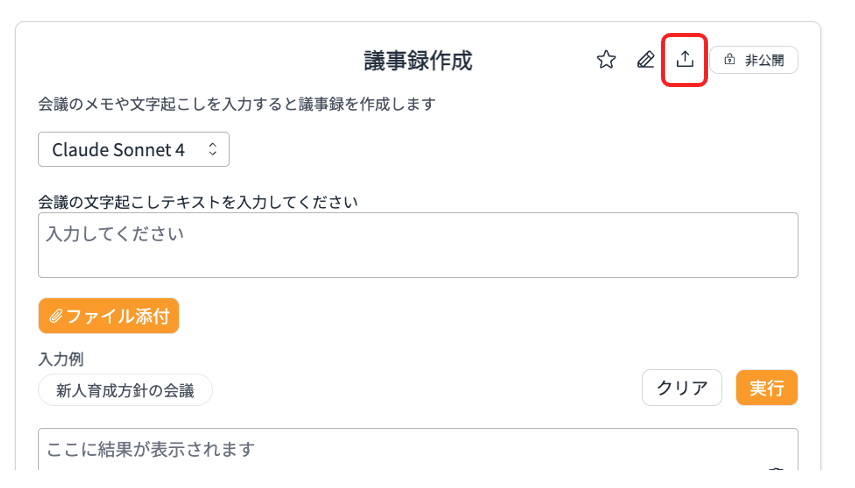
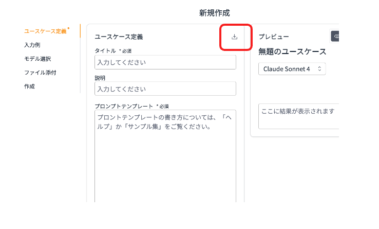

# Generative AI Use Cases

Using the usecase builder mode of [Generative AI Use Cases](https://github.com/aws-samples/generative-ai-use-cases-jp), you can add and share your own use cases. You can also import/export each use case as a .json file. Here, we introduce practical use cases that you can import and use right away.

## Exporting a use case

Click the export icon from the created use case screen to download the file.

## Importing a use case
Click the import icon from the new usecase creation screen and select a file to insert the use case content.

)

## Ready-to-use use cases
You can freely download the following use cases and import them into your environment to try them out.

### Tools :hammer:

|Title                |Description                                                                                     |Download Link|
|:---------------------|:------------------------------------------------------------------------------------------------|:---:|
|Usecase Builder - Builder|A use case that creates use cases themselves. It automatically generates prompt templates when given a use case description and input.|[Download](../assets/usecases/usecase_builder_builder.json){download="" }|
|Prompt Optimizer|Analyzes prompts and optimizes them based on best practices. Helps create more effective prompts.|[Download](../assets/usecases/prompt_optimizer.json){download="" }|
|Excel Formula Generator|Generates Excel or Google Sheets formulas from natural language instructions.|[Download](../assets/usecases/excel_formula_generator.json){download="" }|
|SQL Query Explainer|Explains complex SQL statements in plain language that non-engineers can understand.|[Download](../assets/usecases/sql_query_explainer.json){download="" }|
|Error Log Analyzer|Analyzes error messages and logs, providing causes and solutions.|[Download](../assets/usecases/error_log_analyzer.json){download="" }|
|PII Masking|Automatically identifies and masks personal information and confidential data in contracts and meeting minutes.|[Download](../assets/usecases/pii_masking.json){download="" }|
|Writing Style Converter|Naturally converts text between formal and casual Japanese writing styles.|[Download](../assets/usecases/writing_style_converter.json){download="" }|

### General Business :office:
|Title                |Description                                                                                     |Download Link|
|:---------------------|:------------------------------------------------------------------------------------------------|:---:|
|Meeting Minutes Creation Assistant|A use case that generates meeting minutes. It automatically creates minutes when you input meeting transcripts or notes.|[Download](../assets/usecases/generate_meeting_minutes.json){download="" }|
|Plain Japanese Converter|Converts complex text into "Plain Japanese" that is easy to understand for foreigners and children.|[Download](../assets/usecases/plain_japanese_converter.json){download="" }|

### Management :chart_with_upwards_trend:

|Title                |Description                                                                                     |Download Link|
|:---------------------|:------------------------------------------------------------------------------------------------|:---:|
|Meeting Agenda Designer|Creates efficient and productive meeting agendas based on meeting purpose and participants.|[Download](../assets/usecases/meeting_agenda_designer.json){download="" }|
|Team Daily Report Organizer|Analyzes daily reports from all team members and summarizes them for managers.|[Download](../assets/usecases/team_daily_report_organizer.json){download="" }|

### HR & Talent Development :busts_in_silhouette:

|Title                |Description                                                                                     |Download Link|
|:---------------------|:------------------------------------------------------------------------------------------------|:---:|
|Interview Question Generator|Analyzes candidate resumes and generates effective deep-dive question lists.|[Download](../assets/usecases/interview_question_generator.json){download="" }|
|Job Posting Generator|Creates clear and attractive job postings that highlight company appeal.|[Download](../assets/usecases/job_posting_generator.json){download="" }|
|Performance Feedback Generator|Creates constructive and specific performance feedback based on behavioral notes.|[Download](../assets/usecases/performance_feedback_generator.json){download="" }|

### Management :chart_with_upwards_trend:

|Title                |Description                                                                                     |Download Link|
|:---------------------|:------------------------------------------------------------------------------------------------|:---:|
|SWOT Analysis|Conducts SWOT analysis and proposes strategic options based on business overview and competitor information.|[Download](../assets/usecases/swot_analysis.json){download="" }|
|Business Idea Critic|Analyzes risks and failure scenarios from a critical perspective for new business ideas and initiatives.|[Download](../assets/usecases/business_idea_critic.json){download="" }|

### Legal :balance_scale:

|Title                |Description                                                                                     |Download Link|
|:---------------------|:------------------------------------------------------------------------------------------------|:---:|
|NDA Contract Checker|Analyzes NDA (Non-Disclosure Agreement) contracts and identifies unfavorable clauses and missing provisions.|[Download](../assets/usecases/nda_contract_checker.json){download="" }|
|Contract Term Checker|Checks for missing or inconsistent defined terms in contracts, identifying terms that are defined but not used or used but not defined.|[Download](../assets/usecases/contract_term_checker.json){download="" }|
|Contract Party Checker|Verifies that "Party A" and "Party B" are used appropriately in contracts, checking consistency of obligations and responsibilities.|[Download](../assets/usecases/contract_party_checker.json){download="" }|

### Education :mortar_board:

|Title                |Description                                                                                     |Download Link|
|:---------------------|:------------------------------------------------------------------------------------------------|:---:|
|Comprehension Test Generator|Creates high-quality tests and model answers based on material content.|[Download](../assets/usecases/comprehension_test_generator.json){download="" }|
|Analogy Generator|Explains complex and abstract concepts using familiar analogies that the target audience can understand.|[Download](../assets/usecases/analogy_generator.json){download="" }|

### Sales :handshake:

|Title                |Description                                                                                     |Download Link|
|:---------------------|:------------------------------------------------------------------------------------------------|:---:|
|Customer Review Analysis|Analyzes product reviews, extracts common complaints and unexpected evaluation points, and proposes improvements.|[Download](../assets/usecases/customer_review_analysis.json){download="" }|
|Complaint Response Email|Creates appropriate and sincere response emails to customer complaints.|[Download](../assets/usecases/complaint_response_email.json){download="" }|
|Voicemail Script Generator|Creates appropriate voicemail message scripts for business situations.|[Download](../assets/usecases/voicemail_script_generator.json){download="" }|

### Marketing :mega:

|Title                |Description                                                                                     |Download Link|
|:---------------------|:------------------------------------------------------------------------------------------------|:---:|
|Catchphrase Generator|Generates 10 attractive catchphrase ideas for LP headers based on product features and target audience.|[Download](../assets/usecases/catchphrase_generator.json){download="" }|
