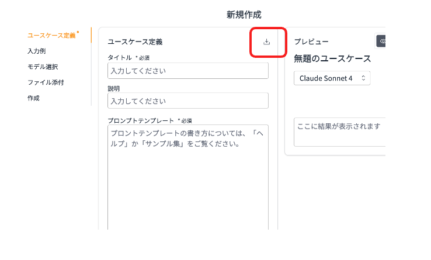

# Generative AI Use Cases

Using the usecase builder mode of [Generative AI Use Cases](https://github.com/aws-samples/generative-ai-use-cases-jp), you can add and share your own use cases. You can also import/export each use case as a .json file. Here, we introduce practical use cases that you can import and use right away.

## How to import/export use cases in the usecase builder

### Importing a use case
Click the import icon from the new usecase creation screen and select a file to insert the use case content.

### Exporting a use case
Click the export icon from the created use case screen to download the file.

## Ready-to-use use cases
You can freely download the following use cases and import them into your environment to try them out.

### Tools :hammer:

|Title                |Description                                                                                     |Download Link|
|:---------------------|:------------------------------------------------------------------------------------------------|:---:|
|Usecase Builder - Builder|A use case that creates use cases themselves. It automatically generates prompt templates when given a use case description and input.|[Download](../assets/usecases/usecase_builder_builder.json){download="" }|

### General Business :office:
|Title                |Description                                                                                     |Download Link|
|:---------------------|:------------------------------------------------------------------------------------------------|:---:|
|Meeting Minutes Creation Assistant|A use case that generates meeting minutes. It automatically creates minutes when you input meeting transcripts or notes.|[Download](../assets/usecases/generate_meeting_minutes.json){download="" }|
