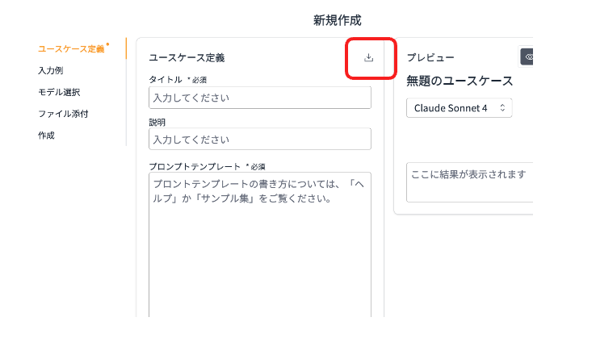

# Generative AI Use Cases

[Generative AI Use Cases](https://github.com/aws-samples/generative-ai-use-cases-jp) のユースケースビルダーモードを使用すると、独自のユースケースを追加・共有できます。また、.jsonファイルで各ユースケースを import/export することが可能です。ここでは、すぐに import してご利用いただける実践的なユースケースをご紹介します。

## ユースケースビルダーでのユースケースの import/export方法

### ユースケースの import
ユースケースの新規作成画面から import のアイコンをクリックし、ファイルを選択するとユースケースの文面が挿入されます。

### ユースケースの export
作成したユースケースの画面から export アイコンをクリックするとファイルがダウンロードされます。

## Ready-to-use ユースケース
以下のユースケースは自由にダウンロードし、ご自身の環境にインポートしてお試しいただけます。

### ツール系 :hammer:

|タイトル                |説明                                                                                                |ダウンロードリンク|
|:---------------------|:------------------------------------------------------------------------------------------------|:---:|
|ユースケースビルダー - ビルダー|ユースケース自体を作成するユースケースです。ユースケースの説明と入力を与えるとプロンプトテンプレートを自動生成します。|[ダウンロード](../assets/usecases/usecase_builder_builder.json){download="" }|

### ビジネス一般 :office:
|タイトル                |説明                                                                                                |ダウンロードリンク|
|:---------------------|:------------------------------------------------------------------------------------------------|:---:|
|議事録作成アシスタント       |議事録を生成するユースケースです。会議の文字起こしやメモを入力すると議事録を自動的に生成します。                                                |[ダウンロード](../assets/usecases/generate_meeting_minutes.json){download="" }|

