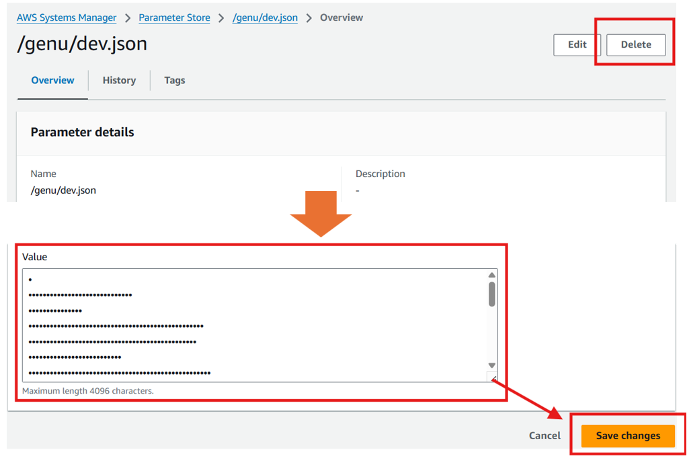

# How to Update, Change Parameters, and Delete GenU

This guide explains how to update and change parameters after deploying GenU with one-click deployment. For detailed parameters supported by GenU, please refer to the [GenU documentation](https://aws-samples.github.io/generative-ai-use-cases/en/ABOUT.html).

## Two Update Methods

GenU offers the following two update methods:

### 🚀 **Method 1: One-Click Update (Recommended)**
- **Update Method**: Update with one click from your browser, inheriting previous deployment settings
- **Use Case**: When you want to update GenU to the latest version without changing settings (*)
- **Benefits**: No development environment setup required

*If there are changes to parameter names, settings may not be reflected properly. We recommend checking the content of [AWS Systems Manager Parameter Store](https://docs.aws.amazon.com/systems-manager/latest/userguide/systems-manager-parameter-store.html) where previous settings are stored, and the [GenU documentation](https://aws-samples.github.io/generative-ai-use-cases/en/ABOUT.html) beforehand.

### 🛠️ **Method 2: SageMaker Studio Code Editor (Advanced)**
- **Update Method**: Set up a development environment in SageMaker Studio Code Editor and update GenU
- **Use Case**: When changing parameters not supported by one-click deployment or developing custom use cases
- **Benefits**: Allows parameter customization and Git-based update history management

---

## Method 1: One-Click Update

This is the simplest method. You can automatically inherit previous deployment settings and update GenU to the latest version.

### Checking Current Parameters

In one-click deployment, parameters used during GenU deployment are stored in [AWS Systems Manager Parameter Store](https://docs.aws.amazon.com/systems-manager/latest/userguide/systems-manager-parameter-store.html) in JSON format.

Open the [Parameter Store management console (Tokyo region `ap-northeast-1`)](https://ap-northeast-1.console.aws.amazon.com/systems-manager/parameters) and check the parameters. If you deployed to a region other than Tokyo, check in your deployment region (e.g., `us-east-1`).

The following parameters are stored with the Environment name specified during deployment (default is `dev`):
- `/genu/dev.json` - All parameters for the dev environment stored in JSON format

!!! Tip
    If you deployed with `staging` or `prod`, they will be `/genu/staging.json` and `/genu/prod.json` respectively.


The parameter content is stored in JSON format like this:

```json
{
  "modelRegion": "us-east-1",
  "modelIds": [
    "us.anthropic.claude-sonnet-4-20250514-v1:0",
    "us.anthropic.claude-opus-4-20250514-v1:0",
    "us.deepseek.r1-v1:0",
    "us.anthropic.claude-3-7-sonnet-20250219-v1:0",
    "us.anthropic.claude-3-5-haiku-20241022-v1:0",
    "us.amazon.nova-premier-v1:0",
    "us.amazon.nova-pro-v1:0",
    "us.amazon.nova-lite-v1:0",
    "us.amazon.nova-micro-v1:0"
  ],
  "ragKnowledgeBaseEnabled": false,
  "selfSignUpEnabled": false,
  "allowedSignUpEmailDomains": null,
  "allowedIpV4AddressRanges": null,
  "allowedIpV6AddressRanges": null
}
```

This is an example of the management console screen (turn on `Show decrypted value` to view the values).


Using this JSON data, you can check and modify parameters in the following procedures (used in both Method 1 and Method 2).

### Steps

1. **Access the [GenU deployment page](../../)**
2. **Select region** (choose the same region as your previous deployment)
3. **If Parameter Store content looks good, click the "Update" button**
4. Confirm the following in the CloudFormation screen:
    - Verify that `UsePreviousDeploymentParameter` is set to `true`
    - Set `Environment` to the same value as before (usually `dev`)
    - Enter your email address in `NotificationEmailAddress`
5. **Click "Create stack"**

!!! Tip
    You can also deploy with changes by modifying the Parameter Store content (the Value section shown as "..." in the figure can be displayed by clicking).
    

## Method 2: SageMaker Studio Code Editor Update

Use this method when you need detailed parameter changes or customization.

The following steps will be performed:

* Check parameters automatically generated by one-click deployment from [AWS Systems Manager Parameter Store](https://docs.aws.amazon.com/systems-manager/latest/userguide/systems-manager-parameter-store.html)
* Prepare development environment with [Amazon SageMaker Studio Code Editor](https://docs.aws.amazon.com/sagemaker/latest/dg/code-editor.html)
* Update and change parameters using CDK

### Setting up Development Environment with SageMaker Code Editor

To update the GenU environment, we'll use SageMaker Code Editor. Create it using CloudFormation from the following link.

!!! Tip
    If you intentionally changed the GenU deployment region from the default Tokyo, also change the SageMaker Code Editor deployment region. If you didn't consciously change it, deploy to Tokyo region using the URL below.

!!! Warning
    Regarding costs, running the default ml.t3.medium in Tokyo region costs $0.065 per hour. Code Editor automatically stops after a period of inactivity, providing cost optimization.

[](https://ap-northeast-1.console.aws.amazon.com/cloudformation/home?region=ap-northeast-1#/stacks/quickcreate?stackName=CodeEditorStack&templateURL=https://ws-assets-prod-iad-r-nrt-2cb4b4649d0e0f94.s3.ap-northeast-1.amazonaws.com/9748a536-3a71-4f0e-a6cd-ece16c0e3487/cloudformation/CodeEditorStack.template.yaml&param_UseDefaultVpc=true&param_EbsSizeInGb=20&param_InstanceType=ml.t3.medium&param_AutoStopIdleTimeInMinutes=180)

CloudFormation will open. Check the box at the bottom of the screen and press Create stack.


Stack creation begins and becomes CREATE_COMPLETE after about 7 minutes. Then open SageMakerStudioUrl from the Outputs tab.


The SageMaker Studio AI screen opens, so press Skip.


Open Code Editor and press Open. If it was stopped, start it first, then press Open.


### Using CDK for Updates and Parameter Changes

The SageMaker Code Editor screen is now open. Press New Terminal.


Execute the following command in the terminal to clone the latest GenU source code. Cloning the latest source code enables GenU version updates. For second and subsequent version updates where you've already done git clone, please refer to [these steps](#second-time-update).

```shell
git clone https://github.com/aws-samples/generative-ai-use-cases.git
```

Here's an image showing where to execute commands. As explained in the image below, the Terminal is displayed at the bottom of the screen, so execute commands here.


Open the cloned folder.


Press "Yes, I trust the authors".


Open `packages/cdk/parameter.ts`.


Press New Terminal again to open the terminal.


Navigate to the directory where you cloned GenU.
```shell
cd /home/sagemaker-user/generative-ai-use-cases/
```

Edit the `parameter.ts` file using the Parameter Store values confirmed in the previous step.
If you're using the default dev Environment, automatic configuration using commands is possible.

!!! Tip
    If you're using something other than `dev`, manually copy the Parameter Store values and directly edit the `parameter.ts` file.

```shell
PARAMS=$(aws ssm get-parameter --name "/genu/dev.json" --with-decryption --query "Parameter.Value" --output text)
```

Next, execute the following command to edit the `parameter.ts` file.

```shell
node -e "
const fs = require('fs');
const params = $PARAMS;
let content = fs.readFileSync('packages/cdk/parameter.ts', 'utf8');
const devStart = content.indexOf('dev: {');
const devEnd = content.indexOf('},', devStart) + 2;
const jsonString = JSON.stringify(params, null, 2);
const indentedJson = jsonString.split('\n').map((line, index) => {
  if (index === 0) return line;
  return '  ' + line;
}).join('\n');
const newDevSection = 'dev: ' + indentedJson + ',';
content = content.substring(0, devStart) + newDevSection + content.substring(devEnd);
fs.writeFileSync('packages/cdk/parameter.ts', content);
"
```

The dev file content should be edited as follows:

```ts
  dev: {
    "modelRegion": "us-east-1",
    "modelIds": [
      "us.anthropic.claude-sonnet-4-20250514-v1:0",
      "us.anthropic.claude-opus-4-20250514-v1:0",
      "us.deepseek.r1-v1:0",
      "us.anthropic.claude-3-7-sonnet-20250219-v1:0",
      "us.anthropic.claude-3-5-haiku-20241022-v1:0",
      "us.amazon.nova-premier-v1:0",
      "us.amazon.nova-pro-v1:0",
      "us.amazon.nova-lite-v1:0",
      "us.amazon.nova-micro-v1:0"
    ],
    "ragKnowledgeBaseEnabled": true,
    "selfSignUpEnabled": false,
    "allowedSignUpEmailDomains": [
      "gmail.com"
    ],
    "allowedIpV4AddressRanges": null,
    "allowedIpV6AddressRanges": null
  },
  staging: {
    // Parameters for staging environment
  },
  prod: {
    // Parameters for production environment
  },
```

This is an example of the screen after editing.


Let's try changing parameters. In this procedure, we'll change the models to use.


Resolve dependencies.
```shell
npm ci
```

Example execution:
```shell
sagemaker-user@default:~/generative-ai-use-cases$ npm ci
npm warn deprecated sourcemap-codec@1.4.8: Please use @jridgewell/sourcemap-codec instead
npm warn deprecated rimraf@3.0.2: Rimraf versions prior to v4 are no longer supported
npm warn deprecated inflight@1.0.6: This module is not supported, and leaks memory. Do not use it. Check out lru-cache if you want a good and tested way to coalesce async requests by a key value, which is much more comprehensive and powerful.
npm warn deprecated glob@7.2.3: Glob versions prior to v9 are no longer supported
npm warn deprecated @humanwhocodes/object-schema@2.0.3: Use @eslint/object-schema instead
npm warn deprecated @humanwhocodes/config-array@0.13.0: Use @eslint/config-array instead
npm warn deprecated eslint@8.57.1: This version is no longer supported. Please see https://eslint.org/version-support for other options.

> generative-ai-use-cases@4.2.7 prepare
> husky


added 2416 packages, and audited 2461 packages in 2m

477 packages are looking for funding
  run `npm fund` for details

3 moderate severity vulnerabilities

To address all issues (including breaking changes), run:
  npm audit fix --force

Run `npm audit` for details.
npm notice
npm notice New minor version of npm available! 11.3.0 -> 11.4.1
npm notice Changelog: https://github.com/npm/cli/releases/tag/v11.4.1
npm notice To update run: npm install -g npm@11.4.1
npm notice
sagemaker-user@default:~/generative-ai-use-cases$ 
```

Update GenU. The `env=dev` parameter specifies the Environment name you want to deploy. The default is dev.

```shell
npm run cdk:deploy:quick -- -c env=dev
```

Example execution:

```shell
sagemaker-user@default:~/generative-ai-use-cases$ npm run cdk:deploy:quick -- -c env=dev

> generative-ai-use-cases@4.2.7 cdk:deploy:quick
> npm -w packages/cdk run cdk deploy -- --all --asset-parallelism --asset-prebuild=false --concurrency 3 --method=direct --require-approval never --force -c env=dev


> cdk
> cdk deploy --all --asset-parallelism --asset-prebuild=false --concurrency 3 --method=direct --require-approval never --force -c env=dev

`cdk synth` may hang in Docker on Linux 5.6-5.10. See https://github.com/aws/aws-cdk/issues/21379 for workarounds.
Bundling asset GenerativeAiUseCasesStackdev/API/Predict/Code/Stage...

  packages/cdk/cdk.out/bundling-temp-d7718a9e133c5da897e2705c0897279a63ba1441a740635cdf58a04513f40f3e-building/index.js  3.3mb ⚠️

⚡ Done in 438ms

added 114 packages, and audited 120 packages in 5s

3 packages are looking for funding
  run `npm fund` for details

found 0 vulnerabilities

```

After some time, deployment completes. The original GenU has been updated.

```shell
GenerativeAiUseCasesStackdev.WebUrl = https://xxxxxxxxx.cloudfront.net
Stack ARN:
arn:aws:cloudformation:us-east-1:xxxxxxxxxx:stack/GenerativeAiUseCasesStackdev/83dbd1f0-3ecb-11f0-a659-0e0290ae6345

✨  Total time: 378.4s

sagemaker-user@default:~/generative-ai-use-cases$ 
```

### Steps for Second and Subsequent GenU Updates {#second-time-update}

This section introduces the steps for second and subsequent GenU updates using SageMaker Code Editor. While the first time used git clone, the second time has different steps since it's already cloned.
After opening SageMaker Code Editor, open the GenU directory with Open Folder.


!!! Warning
    Open `packages/cdk/parameter.ts` and note down the values of `dev`, `staging`, and `prod`. **If you lose them, recovery is difficult, so be careful not to forget to take notes!**


Navigate to the directory where you did git clone.

```shell
cd /home/sagemaker-user/generative-ai-use-cases/
```

Reset all content of files edited in Code Editor to their original state. Please note that if you edited files other than `parameter.ts`, they will all be lost.

```shell
git reset --hard
```

Get the latest version source code with the following command.

```shell
git pull
```

Resolve dependencies with npm ci.

```shell
npm ci
```

Edit the `parameter.ts` file. Restore the `dev`, `staging`, and `prod` values you saved earlier.


Update GenU. The `env=dev` parameter specifies the Environment name you want to deploy. The default is dev.

```shell
npm run cdk:deploy:quick -- -c env=dev
```

The update is now complete!

---

## Steps to Delete GenU {#genu-delete}

This section introduces the steps to delete GenU using SageMaker Code Editor.

After opening SageMaker Code Editor, open the GenU directory with Open Folder. Navigate to the directory where you did git clone in the terminal.

```shell
cd /home/sagemaker-user/generative-ai-use-cases/
```

Delete GenU. The `env=dev` parameter specifies the Environment name you want to deploy. The default is dev.

```shell
npm run cdk:destroy -- -c env=dev
```
