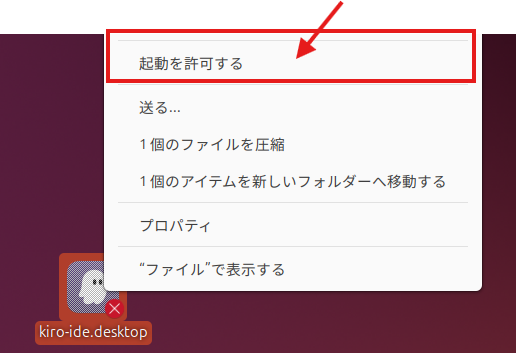

# Kiro IDE Remote

[Kiro](https://kiro.dev/) is an integrated development environment suitable for building Enterprise Ready applications that support the entire development process starting from specification definition. While you can install and use it from the official website, Kiro IDE Remote allows you to access Kiro IDE deployed on a remote desktop via a browser. In addition to Kiro, development tools such as Kiro CLI, AWS CLI, and AWS SAM CLI are pre-installed, allowing you to start development immediately.

## Key Features

- **Cloud-based Development Environment**: Remote desktop environment accessible from a browser
- **High-speed Connection via Amazon DCV**: Provides a comfortable development experience with low latency
- **Pre-installed Development Tools**: Kiro CLI, AWS CLI, AWS SAM CLI, uv, NVM, and more are available
- **English Language Support**: OS and input methods are pre-configured
- **Secure Access**: Safe connection via CloudFront and ALB

## Configuration and Estimated Cost

### System Configuration

- **EC2 Instance**: t3.xlarge (4 vCPU, 16 GiB RAM)
- **EBS Volume**: 40 GB (default, configurable)
- **Networking**: VPC, Subnets, Internet Gateway
- **Load Balancer**: Application Load Balancer
- **Distribution**: CloudFront
- **Other**: Lambda, Secrets Manager, SNS

### Estimated Cost (Tokyo Region)

Monthly cost estimation for main components (24/7 operation):

- **EC2 (t3.xlarge)**: ~$140/month
- **EBS (40 GB)**: ~$4/month
- **Application Load Balancer**: ~$20/month
- **CloudFront**: Based on data transfer (minimum charges apply)
- **Other Services**: ~$1-2/month

**Total Estimate**: ~$165-170/month (excluding data transfer)

> **Note**: Actual costs vary by usage and region. For development use only, you can reduce costs by stopping the instance when not in use. Please refer to the [AWS Pricing page](https://aws.amazon.com/pricing/) for the latest pricing information.

## Deploy to AWS

You can deploy using the button below. Click after logging into AWS.

  

    <select class="region-selector">
      <option value="us-east-1">Virginia</option>
      <option value="us-west-2">Oregon</option>
      <option value="ap-northeast-1">Tokyo</option>
    </select>
    <a href="https://us-east-1.console.aws.amazon.com/cloudformation/home#/stacks/create/review?stackName=KiroIDEDeploymentStack&templateURL=https://aws-ml-jp.s3.ap-northeast-1.amazonaws.com/asset-deployments/KiroIDEDeploymentStack.yaml" class="deployment-button md-button" target="_blank">
      <i class="fa-solid fa-rocket"></i>　Deploy
    </a>
  

### Parameter Settings

* UserEmail
    * User's email address. Used for notification delivery and system configuration.
* UserFullName
    * User's full name. Used for Git configuration and other settings (default: Kiro IDE Developer).
* InstanceType
    * EC2 instance type (default: t3.xlarge).
* InstanceVolumeSize
    * EBS volume size in GB (default: 40).
* RepoUrl
    * Git repository URL to automatically clone for development (optional).
* Language
    * OS language setting. Choose EN (English) or JP (Japanese) (default: EN).

When deployment starts, an email will be sent to the email address set in `UserEmail` to enable notification subscription. Please subscribe from the email to receive notifications.

## Access After Deployment

When deployment is complete, you will receive an email with the following information. You can also check it from the Outputs tab in CloudFormation.

- **KiroIDEURL**: Access URL to Kiro IDE
- **Username**: Login username
- **Password**: Login password
- **InstanceId**: EC2 instance ID

Access the URL and log in with the displayed username and password.

### Initial Setup

* **It is recommended to change your password after logging in**. You can change it using the `passwd` command.
* The Kiro desktop icon is initially disabled. Right-click to allow launching.

### Other Notes

* If authentication with Kiro CLI is slow to proceed, try `kiro-cli login --use-device-flow`.
* Copy & Paste to terminal uses **Ctrl + Shift + V**. This is standard Linux behavior.

## Related Links

- [Kiro Official Website](https://kiro.dev/)
- [Amazon DCV](https://aws.amazon.com/hpc/dcv/)
