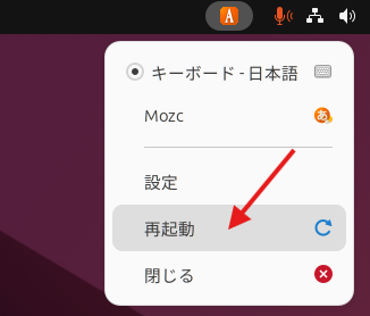

# Kiro IDE Remote

[Kiro](https://kiro.dev/) は、仕様定義から始まる開発工程全体を支援する Enterprise Ready なアプリケーション構築に適した統合開発環境です。公式サイトからインストールしてご利用いただくことももちろん可能ですが、Kiro IDE Remote ではブラウザ経由でリモートデスクトップに構築された Kiro IDE にアクセスできます。Kiro 以外に、Kiro CLI、AWS CLI、AWS SAM CLI などの開発ツールがプリインストールされておりすぐに開発を始めることができます。

## 主な特徴

- **クラウドベースの開発環境**: ブラウザからアクセス可能なリモートデスクトップ環境
- **Amazon DCV による高速接続**: 低遅延で快適な開発体験を提供
- **プリインストールされた開発ツール**: Kiro CLI、AWS CLI、AWS SAM CLI、uv、NVM などが利用可能
- **日本語対応**: OS 及び日本語入力をあらかじめセットアップ
- **セキュアなアクセス**: CloudFront と ALB を経由した安全な接続

## 構成と概算コスト

### システム構成

- **EC2 インスタンス**: t3.xlarge (4 vCPU, 16 GiB RAM)
- **EBS ボリューム**: 40 GB (デフォルト、変更可能)
- **ネットワーク**: VPC、サブネット、Internet Gateway
- **ロードバランサー**: Application Load Balancer
- **配信**: CloudFront
- **その他**: Lambda、Secrets Manager、SNS

### 概算コスト（東京リージョン）

主要コンポーネントの月額概算（24時間稼働の場合）:

- **EC2 (t3.xlarge)**: 約 $140/月
- **EBS (40 GB)**: 約 $4/月
- **Application Load Balancer**: 約 $20/月
- **CloudFront**: データ転送量による（最小料金あり）
- **その他サービス**: 約 $1-2/月

**合計概算**: 約 $165-170/月（データ転送料を除く）

> **注**: 実際のコストは使用量とリージョンにより異なります。開発中のみ使用する場合は、未使用時にインスタンスを停止することでコストを削減できます。最新の料金については [AWS 料金ページ](https://aws.amazon.com/pricing/)をご確認ください。

## AWS へのデプロイ

次のボタンからデプロイできます。AWS へログイン後クリックしてください。

  

    <select class="region-selector">
      <option value="ap-northeast-1">東京</option>
      <option value="us-east-1">バージニア</option>
      <option value="us-west-2">オレゴン</option>
    </select>
    <a href="https://ap-northeast-1.console.aws.amazon.com/cloudformation/home#/stacks/create/review?stackName=KiroIDEDeploymentStack&templateURL=https://aws-ml-jp.s3.ap-northeast-1.amazonaws.com/asset-deployments/KiroIDEDeploymentStack.yaml&amp;param_Language=JP" class="deployment-button md-button" target="_blank">
      <i class="fa-solid fa-rocket"></i>　Deploy
    </a>
  

### パラメータ設定

* UserEmail
    * ユーザーのメールアドレスです。通知の送信先およびシステム設定に使用されます。
* UserFullName
    * ユーザーのフルネームです。Git の設定などに使用されます（デフォルト: Kiro IDE Developer）。
* InstanceType
    * EC2 インスタンスタイプです（デフォルト: t3.xlarge）。
* InstanceVolumeSize
    * EBS ボリュームサイズ（GB）です（デフォルト: 40）。
* RepoUrl
    * 開発用に自動的にクローンする Git リポジトリの URL です（オプション）。
* Language
    * OS の言語設定です。EN（英語）または JP（日本語）を選択できます（デフォルト: EN）。
* EnableAdministratorAccess
    * EC2 インスタンスロールに AdministratorAccess ポリシーをアタッチするかどうかを指定します（デフォルト: false）。CDK のブートストラップやデプロイなど、IDE から AWS リソースを操作する場合は `true` に設定してください。

デプロイが開始すると `UserEmail` に設定したメールアドレスに通知のサブスクリプションを有効化するためのメールが届きます。メールからサブスクライブを行い通知を受け取ってください。

## デプロイ後のアクセス

デプロイが完了すると、下記の案内が書かれたメールが届きます。または、CloudFormation の Outputs タブからも確認できます。

- **KiroIDEURL**: Kiro IDE へのアクセス URL
- **Username**: ログイン用のユーザー名
- **Password**: ログイン用のパスワード
- **InstanceId**: EC2 インスタンス ID

URL にアクセスし、表示されたユーザー名とパスワードでログインしてください。

### 初期設定

* **パスワードはログイン後変更を推奨します**。`passwd` コマンドで変更できます
* デスクトップアイコンの Kiro は最初無効化されています。右クリックで起動を許可してください

### 日本語入力

Ctrl + Space で直接 / 日本語を切り替えられますが、半角・全角キーでの切り替えを行いたい場合一度設定を再起動してください。

### その他

* Kiro CLI で認証がなかなか進まない場合、`kiro-cli login --use-device-flow` を試してみてください
* ターミナルへの Copy & Paste は **Ctrl + Shift + V** になります。これは Linux の仕様です

## 関連リンク

- [Kiro 公式サイト](https://kiro.dev/)
- [Amazon DCV](https://aws.amazon.com/jp/hpc/dcv/)
