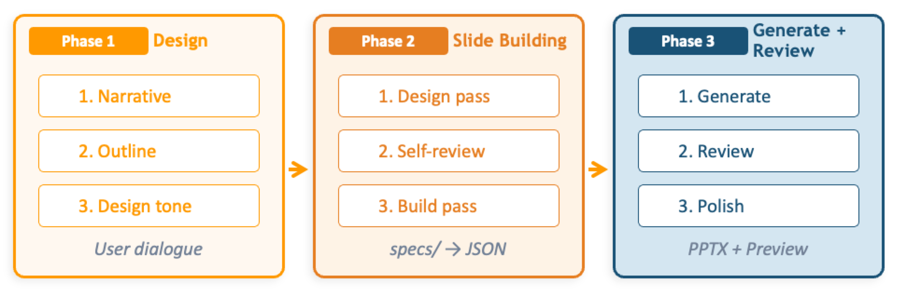

# Spec-Driven Presentation Maker (SDPM)

[Spec-Driven Presentation Maker](https://github.com/aws-samples/sample-spec-driven-presentation-maker) is an open-source application that creates presentation materials using generative AI. It uses a spec-driven development approach — design 'what to convey' first, and let AI build 'how to present it' — to generate structured, high-quality slides.

## Key Features

- **Spec-Driven Design**: Define logical structure as a specification from source materials
- **AI Auto-Build**: AI automatically builds slides following templates
- **4-Layer Architecture**: From Kiro CLI skill to full-stack web app
- **MCP Support**: Available with Claude Desktop, VS Code, Kiro and other MCP clients

## Deploy to AWS

You can deploy using the button below. Please click after logging into AWS.

  

    <select class="region-selector">
      <option value="us-east-1">Virginia</option>
      <option value="us-west-2">Oregon</option>
      <option value="ap-northeast-1">Tokyo</option>
    </select>
    <a href="https://us-east-1.console.aws.amazon.com/cloudformation/home#/stacks/create/review?stackName=SdpmDeploymentStack&templateURL=https://aws-ml-jp.s3.ap-northeast-1.amazonaws.com/asset-deployments/SdpmDeploymentStack.yaml" class="deployment-button md-button" target="_blank">
      <i class="fa-solid fa-rocket"></i>　Deploy
    </a>
  

### Parameter Settings

You can configure the following parameters during deployment:

* **NotificationEmailAddress**: Email address to receive deployment notifications
* **DeploymentLayer**: Deployment layer (default: layer4)
    - `layer3`: MCP Server only
    - `layer4`: Full stack with Agent + Web UI
* **ModelId** (default: global.anthropic.claude-sonnet-4-6): Amazon Bedrock model ID to use for presentation generation. Select a model that is available in your target AWS Region and enabled for your account
* **EnableInvocationLogging** (default: false): Enable Bedrock Model Invocation Logging
* **AllowedIpV4AddressRanges**: Optional IPv4 allow list for access restrictions. Specify the CIDR ranges that should be allowed to access the application
* **AllowedIpV6AddressRanges**: Optional IPv6 allow list for access restrictions. Specify the CIDR ranges that should be allowed to access the application

!!! info "Slide Search"
    Semantic slide search is enabled by default. It uses Bedrock Knowledge Base (Titan Embed V2) + S3 Vectors. Expected cost is **under $0.05/month** for standard usage (1,000 slides, 100 searches/month). See [SDPM Cost Estimates](https://github.com/aws-samples/sample-spec-driven-presentation-maker/blob/main/docs/en/cost.md) for details.

!!! warning "Security Considerations"
    For production use, the following security measures are recommended:

    1. **IP Restrictions**: Restrict access using `AllowedIpV4AddressRanges` / `AllowedIpV6AddressRanges`
    2. **Disable Self-Signup**: Have administrators create users
    3. **Email Domain Restrictions**: Allow signups only from specific domains

### Post-Deployment Setup

After clicking the deployment button, you will receive an email titled `AWS Notification - Subscription Confirmation` after a short while. Click the `Confirm subscription` link to start receiving deployment start and completion notifications.

When deployment is complete, you'll receive a notification email containing:

1. CloudFront URL
2. Instructions for creating users in Cognito

**For Layer 4 (Full Stack):**

1. Create a user in Amazon Cognito
2. Access the web app via the CloudFront URL

**For Layer 3 (MCP Server Only):**

1. Connect to the deployed MCP server endpoint using an MCP client (Claude Desktop, VS Code, Kiro, etc.)

For detailed MCP client setup (mcp.json, Cognito/IAM authentication, mcp-proxy-for-aws), see [Connecting MCP Clients](https://github.com/aws-samples/sample-spec-driven-presentation-maker/blob/main/docs/en/add-to-gateway.md) in the SDPM repository.

### Uninstallation

For instructions on deleting the deployed resources, see the [Uninstall Guide](https://github.com/aws-samples/sample-spec-driven-presentation-maker/blob/main/docs/en/uninstall.md) in the SDPM repository. We recommend using `go-to-k/delstack` for one-shot deletion.
