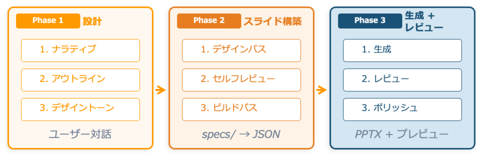

# Spec-Driven Presentation Maker (SDPM)

[Spec-Driven Presentation Maker](https://github.com/aws-samples/sample-spec-driven-presentation-maker) は、プレゼンテーション資料を生成 AI で作成できるオープンソースのアプリケーションです。仕様駆動開発のアプローチを用いて、「何を伝えるか」を先に設計し、「どう見せるか」を AI が構築することで、構造化された高品質なスライドを生成します。

## 主な機能

- **仕様駆動設計**: ソース資料から論理構造を設計書として定義
- **AI自動構築**: テンプレートに準拠してAIがスライドを自動構築
- **4層アーキテクチャ**: Kiro CLIスキルからフルスタックWebアプリまで
- **MCP対応**: Claude Desktop, VS Code, Kiro等のMCPクライアントで利用可能

## AWS へのデプロイ

次のボタンからデプロイできます。AWS へログイン後クリックしてください。

  

    <select class="region-selector">
      <option value="us-east-1">バージニア</option>
      <option value="us-west-2">オレゴン</option>
      <option value="ap-northeast-1">東京</option>
    </select>
    <a href="https://us-east-1.console.aws.amazon.com/cloudformation/home#/stacks/create/review?stackName=SdpmDeploymentStack&templateURL=https://aws-ml-jp.s3.ap-northeast-1.amazonaws.com/asset-deployments/SdpmDeploymentStack.yaml" class="deployment-button md-button" target="_blank">
      <i class="fa-solid fa-rocket"></i>　Deploy
    </a>
  

### パラメータ設定

デプロイ時に以下のパラメータを設定できます：

* **NotificationEmailAddress**: デプロイの開始・終了を通知するメールアドレス
* **DeploymentLayer**: デプロイするレイヤー（デフォルト: layer4）
    - `layer3`: MCPサーバーのみ
    - `layer4`: Agent + Web UIを含むフルスタック
* **ModelId** (デフォルト: global.anthropic.claude-sonnet-4-6): Agent が使用する Amazon Bedrock のモデル ID です。必要に応じて別のモデルへ変更できます
* **EnableInvocationLogging** (デフォルト: false): Bedrock Model Invocation Logging の有効/無効を切り替えます
* **AllowedIpV4AddressRanges**: アクセスを許可する IPv4 アドレス範囲（CIDR）を指定します。推奨される IP 制限を適用する際に使用します
* **AllowedIpV6AddressRanges**: アクセスを許可する IPv6 アドレス範囲（CIDR）を指定します。IPv6 環境での IP 制限に使用します

!!! warning "セキュリティに関する注意点"
    `AllowedIpV4AddressRanges` / `AllowedIpV6AddressRanges` を設定し、アクセス元 IP を制限することを推奨します。

### デプロイ後の設定

デプロイのボタンを押すと、しばらくしてから `AWS Notification - Subscription Confirmation` というメールが届くため `Confirm subscription` のリンクを押してください。これで、デプロイの開始、終了のメールが届くようになります。

デプロイが完了すると通知メールが届きます。通知メールには CloudFront URL 等のアクセス情報が含まれます。また、通知メールアドレスで Cognito ユーザーが自動作成され、仮パスワードが別メールで届きます。

**Layer 4（フルスタック）の場合:**

1. 仮パスワードのメールを確認
2. CloudFront URL からWebアプリにアクセスし、初回ログイン時にパスワードを変更

**Layer 3（MCPサーバーのみ）の場合:**

1. MCPクライアント（Claude Desktop, VS Code, Kiro等）からデプロイされたMCPサーバーエンドポイントに接続

MCP クライアントの接続方法は、SDPM リポジトリの [エージェント接続ガイド](https://github.com/aws-samples/sample-spec-driven-presentation-maker/blob/main/docs/ja/add-to-gateway.md) を参照してください。

### リソースの削除

デプロイしたリソースの削除には [go-to-k/delstack](https://github.com/go-to-k/delstack) の利用を推奨しています。詳細な手順は SDPM リポジトリの [削除手順](https://github.com/aws-samples/sample-spec-driven-presentation-maker/blob/main/docs/ja/uninstall.md) を参照してください。
